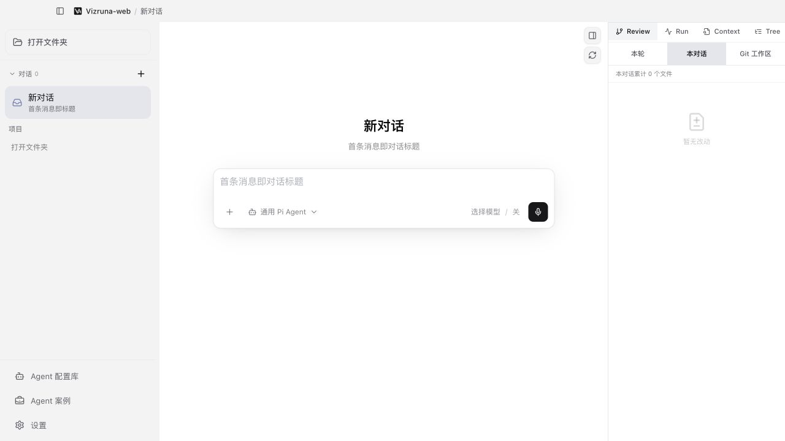

<p align="center">
  
</p>

<p align="center">
  让 Pi 驱动的 AI Agent 在浏览器中可见、可控、可复核。
</p>

<p align="center">
  简体中文 · <a href="README.en.md">English</a>
</p>

# Vizruna

Vizruna 是面向 Pi Agent 的可视化、可组合、本地优先的轻量 Agent Harness。
它把 Pi Agent Runtime 变成一个可以日常使用的本地工作台，并把 Pi 的模型、认证、
Skills、Extensions、提示词、工具和会话运行过程组织成容易理解和调试的图形界面。
**Vizruna-web** 在浏览器中运行；你可以在同一个工作台里和 Agent 对话、观察思考与
工具执行、切换模型和思考强度、检查改动文件、使用终端，并组织多个 Agent 并行工作。

当前状态：**公开 Alpha**。Vizruna-web 是目前唯一维护和发布的用户版本；桌面客户端
已暂停开发与分发。Alpha 阶段请暂时不要把它用于不可中断的关键生产任务。



## v0.1.0-alpha.6 本次重点

- Agent 配置库升级为完整的 Pi-native Agent 工作台：组合模型、思考度、System Prompt、
  工具、Skills、Extensions、Prompt Templates、Packages 与项目上下文，并预览最终有效配置。
- 新增不可变 Agent Version、固定任务评测、版本效果对比和验证门禁，让 Agent 的改进与
  发布建立在真实 Pi 运行证据和人工验收之上。
- 新增 Pi Package Studio 与 Package 导入流程：可导出、安装和迁移成熟 Agent，同时保留
  来源证明、目标环境就绪检查和凭据隔离。
- 新增 Pi 有效配置、资源中心和 Run Debugger，集中检查 Runtime、授权、资源加载、工具
  调用、Context、Token、费用、压缩、错误和逐轮诊断证据。
- 内嵌 Pi Runtime 升级到已验证的 `0.84.4`，补齐 Runtime 契约、生产 SBOM 与资源生命周期
  检查；生产依赖审计为零已知漏洞。
- 重新设计右侧工具导航，按“会话与运行、项目工作区、扩展工具”分组，一行三项，所有入口
  无需横向拖动即可直接切换。

完整变化见 [CHANGELOG.md](CHANGELOG.md)。

## 完整功能

### 对话、模型与运行过程

- **Pi 原生模型工作流**：选择 Provider、模型和思考强度；支持 `/login`、`/logout`、
  OAuth 和 Provider 提供的 API Key 登录；当前内嵌并验证 Pi Runtime `0.84.4`。
- **新对话继承有效配置**：沿用上一次有效会话的模型和思考强度，并立即显示当前选择。
- **按 Provider 分流网络**：海外模型可走 V2Ray 等代理，国内模型保持直连，不修改
  macOS 全局代理，也不影响其他软件。
- **Agent 过程可见**：按真实时间顺序展示用户消息、正在思考、工具调用、流式回答、
  运行统计、上下文用量和对话分支。
- **会话操作**：支持项目会话、临时对话、重命名、Fork、Clone、回退和历史恢复。

### Agent Studio

- **Agent Composer**：创建、编辑、复制、归档命名 Agent；组合 System Prompt、模型、
  思考强度、基础工具、Pi Packages、Skills、Extensions、Prompt Templates 和项目上下文，
  声明推理、图片输入、最低上下文窗口等模型能力要求，并对 Extension 注册工具逐项授权；
  创建会话前可预览最终有效配置。
- **不可变运行快照**：新会话会保存当时真正解析到的 Pi 资源；以后修改 Agent 配置
  不会改变已有会话，右侧 Pi 检查器可查看资源模式和解析数量。
- **Agent Version**：每次有效配置变化自动形成稳定的不可变版本，可查看版本差异并直接
  运行历史版本；通过完整固定评测后才能标记为已验证。已有已验证版本时，新候选还必须
  相对最近基线取得进步或持平，退步、混合结果和证据不足会显示明确原因并阻止晋级。
- **Agent 资产目录**：配置库顶部按“开发中、成熟 Agent、交付版本”汇总和筛选；三种状态
  可以重叠，因此继续编辑的新候选不会遮住更早的成熟或交付版本。交付视图还会核验当前
  项目中的 Pi Package 是否仍完整、身份是否匹配，并提示文件缺失或需要重新生成。
- **Pi Run Debugger**：按当前轮次查看实际工具顺序、Pi 基础/Extension 来源、耗时、
  上下文压缩和错误，并把失败初步定位到认证、Provider、上下文、工具或 Runtime 层；
  每轮保存开始/结束上下文差值和真实加载的 Pi 资源证据。
- **Pi Package Studio**：从已验证 Agent Version 生成 Pi CLI 可直接安装的标准本地
  Package；导出前检查评测门槛、可移植性、外部依赖和失效资源，可仅导出或一键按项目
  安装。目标环境清单会进一步区分 Runtime、模型、Provider 授权、Pi 资源、项目上下文与
  工具策略是否就绪；生成的 `DELIVERY_CHECKLIST.md` 不包含任何凭据。
- **Package 导入与本机复现**：在可信项目内检查 Vizruna Package 的不可变身份和本机实际
  运行条件，再分别确认安装依赖、安装 Agent Package 和加入配置库。导入配置会保存来源
  版本溯源，但作为本地候选重新评测；不会照搬成熟状态、机器路径或任何认证凭据。
- **Agent 生命周期工作台**：从配置卡片进入同一个 Agent 的连续上下文，查看 Pi 配置摘要、
  不可变版本、绑定案例、当前固定任务、最新评测结论、验证阻断和本地 Package 证据，并由
  Vizruna 根据真实缺口提供唯一主操作，直接定位下一步运行、复核、验证或交付。
- **本机运行预检**：运行前根据当前 Pi Runtime、模型授权、Provider 能力、Pi 资源、项目
  上下文和工具策略重新检查；显式依赖缺失时阻止假启动，并提供逐项修复、OAuth 后自动复检
  和手动重试。进入设置修复后返回时仍保留当前 Agent 工作上下文。
- **Agent 运行证据链**：工作台列出真正绑定该 Agent 快照的 Pi 会话，显示不可变版本、
  运行/失败状态、错误原因、消息数、生成文件和已归档案例；可以打开原会话，或把一次真实
  运行直接沉淀为案例及当前版本的评测任务证据。运行工作台采用左侧记录、右侧对象详情，
  文件产物可进入 Review 预览，并可轻量比较两次运行的状态、消息和文件数量。
- **Pi 能力与依赖清单**：不再只显示资源数量；工作台会按基础工具、Pi Package、Extension、
  Skill、Prompt Template 和项目 Context 分组，展示名称、来源、用户级/项目级作用域、
  Extension 注册工具、环境继承项与缺失/禁用阻断，并可直达 Pi 资源中心修复。
- **Runtime 能力证据与漂移诊断**：新运行会持久化 Pi AgentSession 实际加载的工具、Skill、
  Extension、Prompt、Context 文件和 System Prompt 来源，以及运行前后 Context 用量；运行
  工作台将其与该会话的不可变 Agent 快照比较，解释缺失、额外加载、环境继承或完全一致。
  旧运行没有证据时会明确标注“无法判断”，不会伪造结论。
- **Pi 运行健康度**：Run Desk 从当前 Pi 分支的真实时间线汇总 Token、缓存、费用、工具调用
  与失败，并结合运行边界 Context 快照提示高占用、显著增长和压缩；同时区分“已经加载”
  与“本次实际调用”。超长会话明确显示最近 500 条抽样范围。
- **逐轮 Pi 证据**：每次 Agent 运行按 session/run 独立保存开始与结束 Context、Token、工具、
  压缩、文件和错误；Run Desk 可展开最近 50 轮定位问题从哪一轮出现，后续运行不会覆盖
  早期证据，旧会话也不会被当前环境反向推测。
- **证据化运行比较**：选择另一次运行后，并排比较版本、模型、思考度、实际能力、Token、
  费用、工具失败、Context 和压缩变化；确定性规则只标记值得注意的差异，不用模型臆测因果，
  证据缺失或长会话抽样也会明确披露。
- **证据到行动诊断**：Run Desk 按固定规则解释运行失败、能力漂移、Context 压力、工具失败、
  压缩和抽样边界，并给出唯一处理入口；它只打开原运行、重新运行、Pi 资源中心或 Agent
  配置，不自动修改 Agent，也不让模型猜测根因。
- **系统提示词库**：独立管理可复用提示词；新对话也可临时输入一套不入库的提示词。
- **单会话单提示词**：每个新对话只能使用通用 Pi、某套系统提示词或某个 Agent
  配置中的一种，发送首条消息后保持不变。
- **Agent 案例库**：将有效会话归档成案例，保存名称、说明、标签、原项目、原会话、
  模型、思考等级与验证状态；同时冻结 Agent 快照指纹、Pi Runtime 与依赖 Package 版本，
  可随时复验当前环境是否仍能重现案例；案例不复制聊天正文或凭据。
- **Agent Evaluation Studio**：为一个 Agent 建立固定测试任务；每次改版后从真实案例采集
  最后一轮 Pi 会话，冻结 Agent 快照版本、实际输入与输出、模型、耗时、Token、成本、
  工具调用和失败证据，并由用户按照明确标准标记通过、不通过或待复核；可把同一组固定
  任务一键复制到另一个不可变版本，逐任务比较人工结论、Prompt 一致性、耗时、Token、
  成本和工具失败，并保守判断新版进步、持平、退化、结果混合或证据不足。也可在明确
  确认 API 用量与工具副作用后，一键通过隔离后台 Pi 会话串行运行整套回归；进度持久化、
  可取消，单项失败不会中断后续任务，测试结果不会污染 Agent 案例库。版本对比可导出
  Markdown 回归报告；默认隐藏任务正文和模型输出，详细内容需要显式授权。
- **Pi 有效配置检查器**：按当前会话查看 Pi Runtime、模型、认证、网络路线、最终
  System Prompt 来源、工具、Skills、Extensions、Prompt Templates 和 Packages，并
  区分资源是已配置还是已经被当前 Worker 加载。

### 项目工作台与复核

- **文件与终端**：内置文件浏览器和可交互项目终端。
- **Review 工作流**：在右侧查看文件改动、Diff、Markdown 和代码，也可调用 macOS
  默认应用打开文件。
- **Run、Context、Tree**：分别检查运行状态、上下文构成和会话分支，不只依赖
  Agent 的自然语言“已完成”。
- **图片与附件**：支持粘贴图片、引用文件与行号，并在浏览器中预览常见工具结果。

### 多 Agent 与扩展能力

- **受管 Git Worktree**：为并行任务创建隔离分支和工作目录，降低多个 Agent
  互相覆盖的风险。
- **子 Agent 编排**：创建、跟进和检查子任务，展示父子 Agent 状态与验证证据。
- **Skills、扩展与提示词资源**：管理 Pi Skills、Extensions、项目上下文和 Pi 原生
  Prompt 资源，保留与 Pi CLI 兼容的文件结构，并支持 Pi 0.84 的
  `AGENTS.override.md` 同目录覆盖语义。
- **Pi 资源中心**：统一查看用户级与项目级 Pi Packages、Skills、Extensions、Prompt
  Templates 和 Themes；支持 Package 安装、缺失补装、更新检查、更新、移除及 Package
  内单项资源启停，配置始终写入 Pi 原生目录和 `settings.json`。
- **语音输入与提醒**：可配置语音转写；Agent 完成或需要用户确认时可发出本机提醒。

### 界面、数据与可靠性

- **中英文界面**：支持浅色、深色、跟随系统和“鼠尾草浅绿”护眼主题。
- **本地优先**：会话、OAuth、API 配置、案例与 Agent 配置保存在用户自己的电脑。
- **备份与审计**：为产品数据库迁移创建备份，并提供可靠性、恢复和脱敏审计能力。
- **安全更新**：Git 克隆版只在官方来源、干净 `main` 分支和可快进时更新；ZIP 版
  使用新版源码目录启动，用户数据保持不变。

## 安装并使用 Vizruna-web

Vizruna-web 的界面在默认浏览器中打开，Pi Runtime、终端、文件和凭据仍只在你的
电脑上运行，不会上传到 Vizruna 服务器。它使用纯 Node.js 本地后台，不依赖 Electron、
`.app`、DMG、Apple 开发者证书或绕过 Gatekeeper。

### 方式一：npx 一键运行（当前 Alpha 推荐）

安装 Node.js 22.19.0 或更高版本后，在终端运行：

```bash
npx --yes vizruna@alpha
```

首次运行会从 npm 下载约 17 MB 的 Vizruna 程序及运行依赖，随后自动打开默认浏览器；
以后运行同一命令即可获取并启动最新发布版。保持终端窗口开启，按 `Control+C` 停止。
版本升级不会删除会话、Agent 配置、模型授权或案例：这些数据保存在源码和 npm 缓存
之外的 Vizruna/Pi 用户数据目录中。

当前 npm 包已经完成“构建、打包、全新临时项目安装、Runtime 启停、Web 一次性令牌
登录、健康检查和页面加载”自动验证。维护者可运行 `npm run package:npm:test` 验证候选包。

### 方式二：下载 Release 源码包（可审计回退）

1. 安装 [Node.js](https://nodejs.org/zh-cn/download) 22.19.0 或更高版本，安装包中已包含 npm。
2. 打开 [Vizruna Releases](https://github.com/oliverzhu823/vizruna/releases)，下载
   `Vizruna-web-版本-source.zip`；建议同时下载 `SHA256SUMS.txt` 核对文件。
3. 解压 ZIP，进入解压后的 `Vizruna-web-版本` 文件夹。
4. 双击 `Start-Vizruna-web.command`。首次运行会联网安装本地运行依赖并构建页面，
   可能需要几分钟。
5. 默认浏览器自动打开后即可使用。运行期间保持终端窗口开启；要停止 Vizruna-web，
   回到该窗口按 `Control+C`。

需要核对下载文件时，把 ZIP 和 `SHA256SUMS.txt` 放在同一目录并执行：

```bash
grep 'Vizruna-web-.*-source.zip' SHA256SUMS.txt | shasum -a 256 -c -
```

出现 `OK` 才表示文件与 GitHub Release 中的校验记录一致。

如果 macOS 不允许直接执行启动器，右键点击它并选择**打开**。如果仍提示没有权限，
在该文件夹打开终端后执行：

```bash
chmod +x Start-Vizruna-web.command
./Start-Vizruna-web.command
```

不要对其他来源不明的脚本执行上述操作。

### 方式三：使用 Git 克隆（适合持续测试和开发）

在终端运行：

```bash
git clone https://github.com/oliverzhu823/vizruna.git
cd vizruna
./Start-Vizruna-web.command
```

这种方式还需要 Git。启动器会在每次运行时检查官方 `main` 分支；只有 origin 精确
指向 `oliverzhu823/vizruna`、当前分支为 `main`、本地没有改动并且可以快进时才更新。
离线、来源不符、分支分叉或存在本地修改时都会保留原状并继续启动。临时跳过检查可用：

```bash
VIZRUNA_WEB_SKIP_UPDATE=1 ./Start-Vizruna-web.command
```

每个 Release 继续提供 Vizruna-web 源码 ZIP，并附带 SHA-256、SBOM 和 GitHub 构建
来源证明，作为 npx 之外的可审计回退；不再提供桌面安装包。

安全边界：服务只监听 `127.0.0.1`，不能被局域网其他设备访问；每次启动生成新的
随机访问令牌，并使用 HttpOnly 会话、同源校验和 CSRF 防护保护本地 API。不要修改
启动地址为 `0.0.0.0`，也不要把启动链接发给别人。

### 新增：Runtime 与命令行入口（当前开发候选）

本地启动器现在会同时准备独立的 Node Runtime，再打开现有 Vizruna-web。图形界面仍按
原有方式使用；需要自动化、批量运行或排障时，可以在源码目录执行：

```bash
node scripts/vizruna.mjs doctor
node scripts/vizruna.mjs runtime start
node scripts/vizruna.mjs agent list
node scripts/vizruna.mjs run <Agent-ID> --workspace /项目路径 --prompt "任务" --wait
node scripts/vizruna.mjs evidence export <Run-ID> --output run-evidence.json
node scripts/vizruna.mjs runtime stop
```

Runtime 只监听 `127.0.0.1`，使用本机随机令牌和版本化 RPC v1。默认“协作模式”允许
读取和普通文件修改，但命令执行必须由调用者明确批准；还提供只读“观察模式”和有明确
风险提示的“自动模式”。运行记录、事件、权限决定和脱敏证据独立持久化，Runtime 重启后
仍可查询。完整命令见 [Runtime、RPC 与 CLI 实施说明](docs/startup/25-Headless-Runtime-RPC-CLI.md)。

### 启动故障排查

- **提示没有 Node.js**：安装 Node.js 22.19.0 或更高版本，关闭终端窗口后重新启动。
- **启动器没有执行权限**：使用上面的 `chmod +x` 命令，只处理当前下载的启动器。
- **浏览器没有自动打开**：按 `Control+C` 停止后重新双击启动器；不要复用上一次启动
  地址，因为其中的一次性令牌已经失效。
- **提示已有实例运行**：关闭其他 Vizruna-web 启动窗口后重试。同一时间只运行一个实例。
- **首次安装依赖失败**：确认 npm 可以联网，重新运行启动器；它会从中断处重新准备环境。

## 第一次使用

1. 如果要操作代码或文档项目，点击**打开文件夹**；如果只是临时对话，直接使用
   **新对话**。
2. 点击输入框旁边的模型入口，选择 Provider、模型和思考强度。
3. 在输入框输入 `/login` 完成登录，或打开**设置 → 模型**。需要退出某个模型账号
   时使用 `/logout`。
4. 新对话如需特定角色，可在输入框左下角选择**系统提示词**或**Agent 配置**；
   不选择则使用通用 Pi。
5. 输入你希望 Agent 完成的结果。Vizruna 会立即显示你的消息，然后按时间顺序显示
   “正在思考”、工具执行和最终回答。
6. 使用右侧的 **Review、Run、Context、Tree** 检查结果。点击有改动的 Markdown
   文件可在右侧预览；如果更习惯本机软件，也可以选择使用默认应用打开。

### 海外模型走代理、国内模型直连

进入**设置 → Provider 路由**，先添加一个代理配置，再分别给各个 Provider 选择
路线。例如，让 OpenAI Codex 使用 V2Ray 配置，同时让中国模型 Provider 保持
**直连**。该配置只作用于对应的 Agent Worker，不会改写系统全局代理，因此不会
影响其他软件。

## Agent 配置、系统提示词和案例怎么用

- **只是想临时定制下一次对话**：新建对话 → 打开 Agent/提示词选择器 → 临时自定义
  System Prompt。它只用于这次新会话，不进入库。
- **提示词会重复使用，但模型等设置仍想临时选择**：进入**设置 → 提示词 → 会话系统
  提示词**，保存到提示词库；新建对话时选择它。
- **已经形成稳定角色或工作方法**：进入 **Agent 配置库**，建立命名 Agent；以后
  直接从该配置启动对话。
- **一次真实任务已经跑通，值得沉淀和复测**：在当前会话中选择归档为 **Agent
  案例**，填写说明和标签；复核后将状态标记为“已验证”。
- **需要判断 Agent 改版后是否更好**：进入 **Agent 评测**，为目标 Agent 建立评测集和
  固定任务；评测集会固定具体 Agent Version。点击“运行整套回归”并确认真实调用成本后，
  Vizruna 会在隔离后台 Pi 会话中串行执行全部任务、自动采集证据，再按人工验收标准记录
  结论；仍可单独运行任务并手动附加已有案例。
  Agent 更新后点击“评测另一版本”，Vizruna 会原样复制固定任务但不复制旧结果；新版运行
  并复核完成后，会显示逐任务回归和整体判断。只有全部任务通过、固定输入未漂移，并且
  相对最近已验证基线进步或持平时，版本历史才允许将其标记为“已验证”，再进入 Pi Package
  Studio；被阻止时页面会直接说明缺少哪项证据。

System Prompt 负责固定 Agent 的角色、目标、边界和输出要求；需要在运行过程中按需
调用的方法，更适合做成 Skill。

## 升级与数据保留

**Git 克隆版**：正常双击启动器即可。满足官方来源、干净 `main` 分支和可快进三个
条件时，启动器会先安全更新代码，再安装有变化的依赖并重新构建。

**Release ZIP 版**：停止旧版本，从 Releases 下载新版 ZIP，解压到一个新文件夹，
然后运行新文件夹里的启动器。确认新版正常后可以删除旧的源码文件夹；不要把用户数据
目录一起删除。ZIP 副本不会自行覆盖源码，避免更新失败时损坏当前可用版本。

两种升级方式都不会删除以下外部数据：

- `~/Library/Application Support/Vizruna`：产品设置、Agent 配置、提示词库、案例索引
  和数据库。
- `~/.pi/agent`：Pi 会话、OAuth 与 Provider 配置。
- `~/.vizruna/worktrees`：受管工作目录。

请勿手动或使用清理工具删除这些目录。Alpha 阶段升级前建议备份上述目录；数据库只
保证向前迁移，不建议运行新版后再降级。

## 用户数据与隐私

- 每位用户的 Pi 会话和认证信息保存在自己 Mac 的 `~/.pi/agent`。
- Vizruna 的偏好设置和产品元数据保存在
  `~/Library/Application Support/Vizruna`。
- Release 源码包由 GitHub 从仓库提交生成，不包含维护者的对话、最近项目、Token、代理密码
  或本机路径。
- 用户仍应避免在提示词中发送敏感信息，也不要把凭据提交进项目仓库。

## 反馈与参与

Vizruna 欢迎早期用户。你可以通过 [GitHub Issues](https://github.com/oliverzhu823/vizruna/issues)
报告问题、提出改进建议，或者描述你希望 Agent 支持的真实工作流程。反馈时建议提供
Vizruna 版本、macOS 版本、Mac 型号和所用模型 Provider，但不要公开 API Key、OAuth
Token 或私人对话内容。

## 本地开发

环境要求：Node.js 22.19.0 或更高版本、npm 和 Git。当前用户发布流程已在 macOS
完成验收；Windows 和 Linux 尚未承诺公开 Alpha 支持。

`npm run dev:web` 使用与公开 Vizruna-web 相同的本机产品数据，便于复现真实使用状态；
修改数据库或凭据相关功能前应先备份。自动化 E2E 使用独立临时用户目录和 Pi 目录，
不会读取正式用户的 OAuth、API Key 或会话。

```bash
nvm use
npm ci
npm run dev:web
```

日常产品开发和验收都使用 Vizruna-web。桌面客户端源码暂时保留作为共享运行时和回退
参考，但停止功能迭代，也不进入预发布产物。

执行完整质量检查：

```bash
npm run verify
```

运行浏览器端端到端测试：

```bash
npm run test:e2e:install
npm run test:e2e:web
```

打上版本 Tag 后，GitHub 工作流只生成版本化 Vizruna-web 源码 ZIP、SHA-256、SBOM
和构建来源证明，不构建或上传 DMG、`.app` 或桌面 ZIP。
