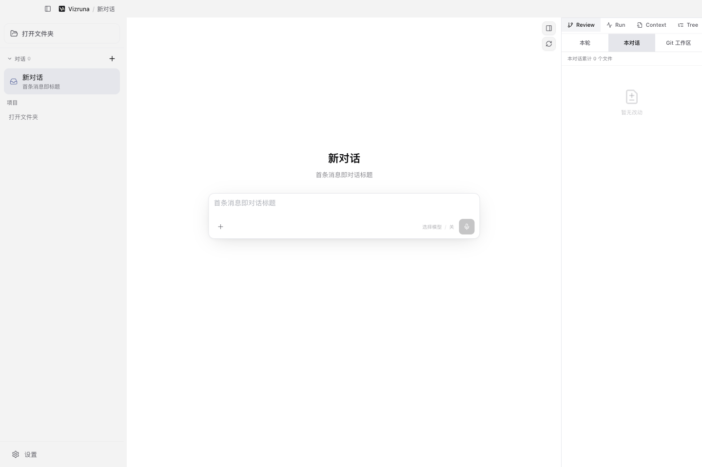

<p align="center">
  
</p>

<p align="center">
  让 Pi 驱动的 AI Agent 在桌面上可见、可控、可复核。
</p>

<p align="center">
  简体中文 · <a href="README.en.md">English</a>
</p>

# Vizruna

Vizruna 把 Pi Agent Runtime 变成一个可以日常使用的桌面产品。你可以在同一个
工作台里和 Agent 对话、观察思考与工具执行、切换模型和思考强度、检查改动文件、
使用终端，并组织多个 Agent 并行工作。

当前状态：**公开 Alpha**。所有人都可以下载和使用 Vizruna。现阶段可下载安装的
版本支持 **Apple 芯片 Mac（M1/M2/M3/M4 及后续型号）**。我们正在寻找早期用户和
真实反馈；Alpha 阶段请暂时不要把它用于不可中断的关键生产任务。



## v0.1.0-alpha.3 本次重点

- 新增 **Agent 配置库**：为不同业务场景保存命名 Agent 和固定 System Prompt。
- 新增 **会话系统提示词库**：可新增、编辑、复制和归档常用提示词，也可只为下一次
  新对话输入临时提示词。
- 新对话可在**通用 Pi、系统提示词、Agent 配置**中三选一；首条消息发送后固化快照，
  避免后续修改配置影响已经开始的会话。
- 新增 **Agent 案例库**：把跑通的真实会话沉淀为案例，记录模型、思考等级、标签和
  验证状态，并可返回原会话继续复测。
- 修复新版本模型载入、Provider 配置导入与预发布版本更新判断。
- 优化消息区操作按钮避让、输入框信息字号和“正在思考”即时反馈。
- 开发环境与安装版彻底隔离，发布包不会继承维护者的会话、模型授权和 API 配置。
- 增加无签名测试版的应用内更新提醒：自动下载并打开新版 DMG，由用户手动覆盖应用。

完整变化见 [CHANGELOG.md](CHANGELOG.md)。

## 完整功能

### 对话、模型与运行过程

- **Pi 原生模型工作流**：选择 Provider、模型和思考强度；支持 `/login`、`/logout`、
  OAuth 和 Provider 提供的 API Key 登录。
- **新对话继承有效配置**：沿用上一次有效会话的模型和思考强度，并立即显示当前选择。
- **按 Provider 分流网络**：海外模型可走 V2Ray 等代理，国内模型保持直连，不修改
  macOS 全局代理，也不影响其他软件。
- **Agent 过程可见**：按真实时间顺序展示用户消息、正在思考、工具调用、流式回答、
  运行统计、上下文用量和对话分支。
- **会话操作**：支持项目会话、临时对话、重命名、Fork、Clone、回退和历史恢复。

### Agent Studio

- **Agent 配置库**：创建、编辑、复制、归档命名 Agent，为固定场景保存 System
  Prompt；从配置库可直接创建新对话。
- **系统提示词库**：独立管理可复用提示词；新对话也可临时输入一套不入库的提示词。
- **单会话单提示词**：每个新对话只能使用通用 Pi、某套系统提示词或某个 Agent
  配置中的一种，发送首条消息后保持不变。
- **Agent 案例库**：将有效会话归档成案例，保存名称、说明、标签、原项目、原会话、
  模型、思考等级与验证状态；案例不复制聊天正文或凭据。

### 项目工作台与复核

- **文件与终端**：内置文件浏览器和可交互项目终端。
- **Review 工作流**：在右侧查看文件改动、Diff、Markdown 和代码，也可调用 macOS
  默认应用打开文件。
- **Run、Context、Tree**：分别检查运行状态、上下文构成和会话分支，不只依赖
  Agent 的自然语言“已完成”。
- **图片与附件**：支持粘贴图片、引用文件与行号，并为常见工具结果提供桌面预览。

### 多 Agent 与扩展能力

- **受管 Git Worktree**：为并行任务创建隔离分支和工作目录，降低多个 Agent
  互相覆盖的风险。
- **子 Agent 编排**：创建、跟进和检查子任务，展示父子 Agent 状态与验证证据。
- **Skills、扩展与提示词资源**：管理 Pi Skills、Extensions、项目上下文和 Pi 原生
  Prompt 资源，保留与 Pi CLI 兼容的文件结构。
- **语音输入与提醒**：可配置语音转写；Agent 完成或需要用户确认时可发出桌面提醒。

### 界面、数据与可靠性

- **中英文界面**：支持浅色、深色、跟随系统和“鼠尾草浅绿”护眼主题。
- **本地优先**：会话、OAuth、API 配置、案例与 Agent 配置保存在用户自己的电脑。
- **备份与审计**：为产品数据库迁移创建备份，并提供可靠性、恢复和脱敏审计能力。
- **更新提醒**：可自动或手动检查 GitHub Releases，下载并打开新安装包。

## 下载和安装

1. 打开仓库的 [Releases 页面](https://github.com/oliverzhu823/vizruna/releases)。
2. 在最新的预发布版本中下载 `Vizruna-*-arm64.dmg`。
3. 建议同时下载 `SHA256SUMS.txt` 并核对安装包校验值。
4. 打开 DMG，把 **Vizruna** 拖到“应用程序”文件夹。
5. 双击启动 Vizruna。

当前 Alpha 安装包**没有 Developer ID 签名和 Apple 公证**。首次运行时，macOS
可能提示无法验证开发者。确认文件来自本仓库且 SHA-256 一致后：

1. 先尝试打开一次 Vizruna。
2. 进入**系统设置 → 隐私与安全性**，在安全性区域点击**仍要打开**。
3. 如果系统直接提示应用“已损坏”，校验文件无误后，可在终端仅移除这个应用的下载
   隔离属性：

```bash
xattr -dr com.apple.quarantine /Applications/Vizruna.app
```

不要对来源不明的软件执行该命令，也不要全局关闭 Gatekeeper。

当前 DMG 只适用于 Apple 芯片 Mac。Windows、Linux 和 Intel Mac 尚未完成发布验收。

## 第一次使用

1. 如果要操作代码或文档项目，点击**打开文件夹**；如果只是临时对话，直接使用
   **新对话**。
2. 点击输入框旁边的模型入口，选择 Provider、模型和思考强度。
3. 在输入框输入 `/login` 完成登录，或打开**设置 → 模型**。需要退出某个模型账号
   时使用 `/logout`。
4. 新对话如需特定角色，可在输入框左下角选择**系统提示词**或**Agent 配置**；
   不选择则使用通用 Pi。
5. 输入你希望 Agent 完成的结果。Vizruna 会立即显示你的消息，然后按时间顺序显示
   “正在思考”、工具执行和最终回答。
6. 使用右侧的 **Review、Run、Context、Tree** 检查结果。点击有改动的 Markdown
   文件可在右侧预览；如果更习惯本机软件，也可以选择使用默认应用打开。

### 海外模型走代理、国内模型直连

进入**设置 → Provider 路由**，先添加一个代理配置，再分别给各个 Provider 选择
路线。例如，让 OpenAI Codex 使用 V2Ray 配置，同时让中国模型 Provider 保持
**直连**。该配置只作用于对应的 Agent Worker，不会改写系统全局代理，因此不会
影响其他软件。

## Agent 配置、系统提示词和案例怎么用

- **只是想临时定制下一次对话**：新建对话 → 打开 Agent/提示词选择器 → 临时自定义
  System Prompt。它只用于这次新会话，不进入库。
- **提示词会重复使用，但模型等设置仍想临时选择**：进入**设置 → 提示词 → 会话系统
  提示词**，保存到提示词库；新建对话时选择它。
- **已经形成稳定角色或工作方法**：进入 **Agent 配置库**，建立命名 Agent；以后
  直接从该配置启动对话。
- **一次真实任务已经跑通，值得沉淀和复测**：在当前会话中选择归档为 **Agent
  案例**，填写说明和标签；复核后将状态标记为“已验证”。

System Prompt 负责固定 Agent 的角色、目标、边界和输出要求；需要在运行过程中按需
调用的方法，更适合做成 Skill。

## 升级与数据保留

Vizruna Alpha 采用**半自动更新**：

1. 应用启动后自动检查，也可在**设置 → 常规 → 应用版本**手动检查。
2. 有新版本时点击**下载并打开安装包**。
3. 完全退出旧版 Vizruna。
4. 把新版拖到“应用程序”，选择**替换**。

覆盖 `/Applications/Vizruna.app` 不会删除以下外部数据：

- `~/Library/Application Support/Vizruna`：产品设置、Agent 配置、提示词库、案例索引
  和数据库。
- `~/.pi/agent`：Pi 会话、OAuth 与 Provider 配置。
- `~/.vizruna/worktrees`：受管工作目录。

请勿使用卸载清理工具删除这些目录。Alpha 阶段升级前建议备份上述目录；数据库只保证
向前迁移，不建议安装新版后再降级。

## 用户数据与隐私

- 每位用户的 Pi 会话和认证信息保存在自己 Mac 的 `~/.pi/agent`。
- Vizruna 的偏好设置和产品元数据保存在
  `~/Library/Application Support/Vizruna`。
- 发布包来自经过清理的构建目录，不包含维护者的对话、最近项目、Token、代理密码
  或本机路径。
- 用户仍应避免在提示词中发送敏感信息，也不要把凭据提交进项目仓库。

## 反馈与参与

Vizruna 欢迎早期用户。你可以通过 [GitHub Issues](https://github.com/oliverzhu823/vizruna/issues)
报告问题、提出改进建议，或者描述你希望 Agent 支持的真实工作流程。反馈时建议提供
Vizruna 版本、macOS 版本、Mac 型号和所用模型 Provider，但不要公开 API Key、OAuth
Token 或私人对话内容。

## 本地开发

环境要求：Node.js 22.19.x、npm、Git；当前安装包目标为 macOS Apple Silicon。

源码开发环境与已安装的正式产品会自动隔离。开发模式显示为 **Vizruna Dev**，应用
设置保存在 `~/Library/Application Support/Vizruna Dev`，Pi 凭据和会话使用该目录
下独立的 `pi-agent` 文件夹，不会继承正式版用户在 `~/.pi/agent` 中的 OAuth 或
API Key。需要构造受控测试数据时，显式设置的 `PI_CODING_AGENT_DIR` 仍具有最高
优先级。

```bash
nvm use
npm ci
npm run dev
```

不要把 `dist/mac-arm64/Vizruna.app` 当成开发入口；它是使用正式产品身份的打包候选
产物。源码开发使用 `npm run dev`，产品验收则使用安装到“应用程序”的 DMG。

执行完整质量检查：

```bash
npm run verify
```

本地开发测试包可以使用：

```bash
npm run package -- --mac
```

当前无签名 Apple Silicon 预发布包使用：

```bash
npm run package:mac:unsigned
```

该命令明确关闭 Developer ID 自动发现，验证产物没有 Developer ID 签名，并确认
Gatekeeper 会按文档所述拦截首次启动。GitHub 预发布工作流还会在隔离数据目录中启动
打包应用、生成 SHA-256、SBOM 和构建来源证明。

未来的正式版仍使用 `npm run package:mac:release`；只要 Developer ID 签名、Apple
公证、票据装订或 Gatekeeper 校验有一项未通过，命令就会失败。
