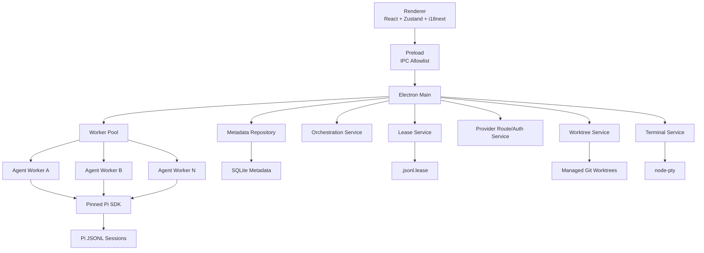
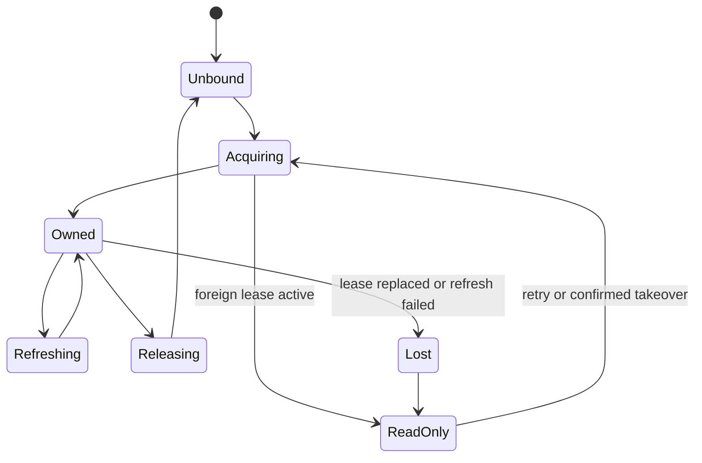
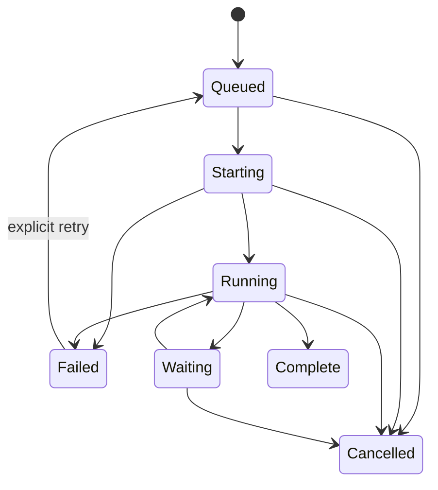
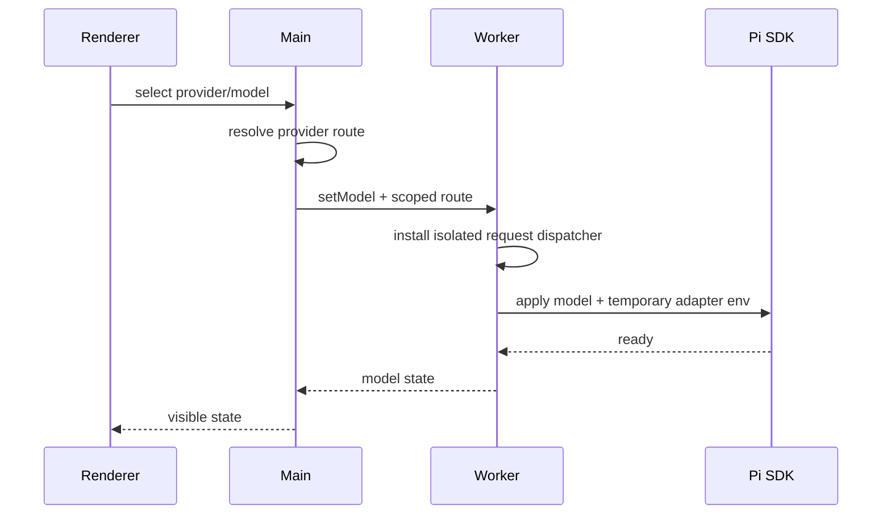

# RFC-001：Vizruna 混合架构

状态：Accepted  
日期：2026-07-24  
决策类型：Architecture  
目标底座：`justhil/pi-app`  
参考实现：`minghinmatthewlam/pi-gui`

## 1. 摘要

本 RFC 确定 Vizruna 的目标架构：

- 以 pi-app 为唯一应用底座。
- 保留 Electron Main、Preload、React Renderer、Utility Worker 四层边界。
- 每个活跃 Agent 在独立 Utility Worker 中运行。
- 在 Main 中新增会话租约、Worktree、Orchestration、Terminal 和 Provider Route 服务。
- Pi JSONL 继续作为会话事实来源。
- 企业桌面元数据使用独立 SQLite 数据库。
- Renderer 只消费结构化状态和事件，不持有文件系统、进程或密钥能力。
- 从 pi-gui 移植行为和测试，不复制其整体 AppStore 或状态模型。

## 2. 背景

pi-app 已具备中文 UI、文件工作台、会话树、Provider 配置、扩展适配和每会话 Worker。pi-gui 已具备更成熟的 Git Worktree、父子线程编排、PTY 终端、Provider 登录和会话租约。

两者运行在相同 Pi Runtime 与 JSONL 会话模型之上，但应用层架构不同。直接复制 UI 或 AppStore 会产生：

- 两套状态源。
- 两套会话生命周期。
- 两套 IPC 风格。
- Main 与 Worker 职责冲突。
- 无法稳定同步上游。

因此采用“行为重实现”策略。

## 3. 架构决策

### ADR-001：以 pi-app 为主底座

状态：Accepted

理由：

- 中文和通用产品能力已经存在。
- Utility Worker 提供会话级进程隔离。
- Main/Preload/Renderer/Worker 边界明确。
- Zustand、i18next、共享 IPC 契约可继续扩展。

### ADR-002：不引入 pi-gui AppStore

状态：Accepted

pi-gui 的 `DesktopAppState` 和 AppStore 不进入目标项目。所有能力映射到 pi-app 的事件、服务和 Zustand Slice。

### ADR-003：Pi JSONL 是会话事实来源

状态：Accepted

消息、工具调用、模型回复和 Pi 会话树仍以 Pi JSONL 为准。不得将它复制为另一份长期主数据。

### ADR-004：混合元数据独立持久化

状态：Accepted

以下数据不写入 Pi JSONL：

- Worktree 归属
- 父子 Agent 关系
- 编排状态
- 验收证据
- 代理路由选择
- 审计事件
- 产品 UI 偏好

### ADR-005：每个 Agent 一个 Worker

状态：Accepted

父 Agent 和子 Agent 均运行在独立 Utility Worker。Main 负责调度与通信，不直接运行 Agent Runtime。

### ADR-006：子 Agent 默认使用独立 Worktree

状态：Accepted

默认隔离可避免并行修改冲突。允许用户或策略显式选择 Local，但必须显示风险。

### ADR-007：macOS Apple Silicon 优先

状态：Accepted

v0.1 首先完成 macOS 签名和验证。代码和数据模型不得依赖 macOS 专属路径语义。

## 4. 目标进程架构



## 5. 进程职责

### 5.1 Renderer

负责：

- 页面和交互。
- Zustand 状态。
- 中文/英文显示。
- 结构化事件展示。
- 用户明确触发操作。

禁止：

- 直接访问 Node API。
- 直接读取或修改文件。
- 持有 API Key、OAuth Token 或代理密码。
- 执行 Git、Shell 或 PTY。
- 自己判断租约是否有效。

### 5.2 Preload

负责：

- 暴露最小 IPC API。
- 限制可调用 Channel。
- 转发类型化事件。

要求：

- 不暴露通用 `fs`、`exec` 或任意 Channel。
- 所有新增 Channel 必须在共享契约和 Main 注册表中出现。
- 请求和响应必须有运行时 Schema。

### 5.3 Main

负责：

- 窗口生命周期。
- Worker Pool。
- 服务编排。
- Worktree 和 Git。
- 租约。
- Provider 路由和密钥边界。
- PTY。
- SQLite 元数据。
- 崩溃恢复。
- 系统通知。

Main 不直接承载 Agent 长时间推理。

### 5.4 Utility Worker

负责：

- 加载固定版本 Pi SDK。
- 管理一个活动 Agent Session。
- 执行模型请求和工具调用。
- 将 Pi 事件映射为共享 AppEvent。
- 承载扩展 UI Bridge。
- 注册内置编排工具。
- 接收 Main 下发的 Provider 路由环境。

Worker 不直接：

- 创建 Worktree。
- 创建另一个 Worker。
- 修改全局应用配置。
- 写入企业元数据库。

## 6. 建议目录结构

目标结构沿用 pi-app，不建立第二套应用：

```text
src/
├── main/
│   ├── lease/
│   ├── worktree/
│   ├── orchestration/
│   ├── terminal/
│   ├── provider-routing/
│   ├── metadata/
│   └── ipc/handlers/
├── preload/
├── worker/
│   ├── orchestration-tools/
│   └── provider-runtime/
├── renderer/src/
│   ├── features/worktrees/
│   ├── features/orchestration/
│   ├── features/terminal/
│   ├── features/provider-routing/
│   └── stores/
│       ├── worktree-slice.ts
│       ├── orchestration-slice.ts
│       └── terminal-slice.ts
└── extension-compat/

packages/shared/
├── lease-contracts.ts
├── worktree-contracts.ts
├── orchestration-contracts.ts
├── terminal-contracts.ts
├── provider-route-contracts.ts
└── audit-events.ts
```

## 7. 数据所有权

| 数据 | 权威来源 | 写入者 | 备注 |
|---|---|---|---|
| 对话消息 | Pi JSONL | 持有租约的 Worker | 不复制为主数据 |
| 工具调用 | Pi JSONL | Pi Runtime | Renderer 做投影 |
| 会话树 | Pi JSONL | Pi Runtime | 保持 CLI 兼容 |
| Provider Auth | Pi Auth / safeStorage | Main | Renderer 不接触 |
| 应用偏好 | electron-store | Main | 语言、主题等 |
| Worktree 元数据 | SQLite | Main Worktree Service | 与 Git 实际状态对账 |
| 父子 Agent 关系 | SQLite | Orchestration Service | 不写进 JSONL |
| 编排证据 | SQLite | Orchestration Service | 结构化、可审计 |
| 租约 | `.jsonl.lease` | Lease Service | 文件级单写入约定 |
| 审计事件 | SQLite/JSONL Audit | Main | 不含密钥 |

## 8. 元数据 Schema

第一版建议扩展现有 SQLite 索引，而不是创建第二个数据库。

### 8.1 `managed_worktree`

| 字段 | 类型 | 说明 |
|---|---|---|
| id | TEXT PK | Worktree ID |
| root_workspace_path | TEXT | 根仓库规范路径 |
| worktree_path | TEXT UNIQUE | Worktree 规范路径 |
| branch_name | TEXT | 分支名 |
| status | TEXT | creating/ready/dirty/missing/error/removing/removed |
| created_by_session | TEXT NULL | 创建来源 |
| created_at | INTEGER | 创建时间 |
| updated_at | INTEGER | 更新时间 |
| last_error | TEXT NULL | 已脱敏错误 |

### 8.2 `agent_relationship`

| 字段 | 类型 | 说明 |
|---|---|---|
| id | TEXT PK | 关系 ID |
| parent_session_file | TEXT | 父会话文件 |
| child_session_file | TEXT | 子会话文件 |
| parent_worker_key | TEXT | 父 Worker Key |
| child_worker_key | TEXT | 子 Worker Key |
| worktree_id | TEXT NULL | 子 Agent Worktree |
| goal | TEXT | 原始任务 |
| status | TEXT | 子 Agent 状态 |
| created_at | INTEGER | 创建时间 |
| updated_at | INTEGER | 更新时间 |
| completed_at | INTEGER NULL | 完成时间 |

### 8.3 `orchestration_evidence`

| 字段 | 类型 | 说明 |
|---|---|---|
| id | TEXT PK | 证据 ID |
| relationship_id | TEXT | 父子关系 |
| kind | TEXT | report/command/review/blocker/acceptance |
| status | TEXT | reported/running/passed/failed/blocked/accepted |
| title_key | TEXT | 可本地化消息 ID |
| params_json | TEXT | 结构化参数 |
| detail | TEXT NULL | 原始详情 |
| git_json | TEXT NULL | branch/headSha/workspace |
| created_at | INTEGER | 创建时间 |

### 8.4 `audit_event`

| 字段 | 类型 | 说明 |
|---|---|---|
| id | TEXT PK | 事件 ID |
| actor_type | TEXT | user/agent/system |
| actor_id | TEXT NULL | Actor |
| action | TEXT | 稳定动作代码 |
| target_type | TEXT | session/worktree/provider/worker |
| target_id | TEXT | 目标 |
| result | TEXT | success/failure/denied |
| metadata_json | TEXT | 脱敏元数据 |
| created_at | INTEGER | 时间 |

## 9. 会话租约设计

### 9.1 文件位置

对会话：

```text
session.jsonl
```

租约文件：

```text
session.jsonl.lease
```

确保 Pi 的 `.jsonl` 发现逻辑忽略租约文件。

### 9.2 租约内容

```json
{
  "version": 1,
  "appId": "com.vizruna.desktop",
  "instanceId": "uuid",
  "hostname": "host",
  "pid": 12345,
  "sessionFile": "/absolute/session.jsonl",
  "acquiredAt": "2026-07-25T00:00:00.000Z",
  "refreshedAt": "2026-07-25T00:00:10.000Z"
}
```

### 9.3 判定

- 同实例租约：允许刷新。
- 同主机且 PID 存活：阻止其他实例写入。
- PID 不存在：视为过期。
- 跨主机：按刷新时间和 TTL 判断。
- 文件损坏：不永久阻塞，但记录审计告警。
- CLI 不识别租约：桌面端同时监视会话文件异常追加并提示。

### 9.4 状态



租约丢失后 Worker 必须停止继续发送新消息，避免双写。

## 10. Worktree 设计

### 10.1 受管根目录

默认：

```text
~/.vizruna/worktrees/<repo>/<worktree>
```

所有删除操作必须：

1. 对路径进行 `realpath`/规范化。
2. 验证目标位于受管根目录之下。
3. 验证目标出现在 `git worktree list --porcelain`。
4. 检查工作区是否脏。
5. 默认使用非强制删除。

### 10.2 创建事务

1. 验证根目录是 Git 仓库。
2. 生成唯一分支和目标目录。
3. 写入 `creating` 元数据。
4. 执行 `git worktree add`。
5. 验证路径和分支。
6. 更新为 `ready`。
7. 启动 Worker。
8. 任何步骤失败时执行可恢复回滚。

禁止在数据库未记录来源的情况下强制清理用户目录。

### 10.3 状态

```text
creating -> ready -> dirty -> ready
creating -> error
ready/dirty -> removing -> removed
ready/dirty -> missing
```

## 11. 多 Agent 编排

### 11.1 内置工具

Worker 注册以下稳定工具：

- `create_child_agent`
- `list_child_agents`
- `read_child_agent`
- `send_message_to_child_agent`
- `stop_child_agent`

工具参数和结果使用语言无关的结构化对象。UI 翻译不进入工具协议。

### 11.2 Worker 到 Main RPC

示例：

```ts
type OrchestrationRequest =
  | {
      type: "orchestration.createChild";
      requestId: string;
      parentSessionFile: string;
      goal: string;
      environment: "worktree" | "local";
    }
  | {
      type: "orchestration.listChildren";
      requestId: string;
      parentSessionFile: string;
    }
  | {
      type: "orchestration.readChild";
      requestId: string;
      relationshipId: string;
    }
  | {
      type: "orchestration.sendMessage";
      requestId: string;
      relationshipId: string;
      text: string;
    }
  | {
      type: "orchestration.stopChild";
      requestId: string;
      relationshipId: string;
    };
```

正式实现必须放入共享契约并通过运行时 Schema 校验。

### 11.3 状态机



### 11.4 并发策略

- 默认 Worker 上限：4。
- 父 Agent也占用一个 Worker。
- 超过上限的子 Agent进入队列。
- 运行中的 Worker不因 LRU 被回收。
- 空闲 Worker按策略回收。
- 每个父 Agent可设置更低的子 Agent上限。
- 取消父任务不默认删除子 Worktree。

### 11.5 输出读取

读取子 Agent输出时：

- 以子会话 JSONL 为事实来源。
- 返回摘要、状态、最近消息和证据。
- 默认限制文本长度，避免把整个历史塞回父 Agent上下文。
- 支持显式分页。

## 12. Provider 路由

### 12.1 路由模式

```ts
type ProviderRouteMode = "direct" | "system" | "profile";
```

- `direct`：清除 Worker 内代理环境，保留必要 `NO_PROXY`。
- `system`：继承应用启动时捕获的登录 Shell/系统代理。
- `profile`：只在目标 Worker 安装指定请求调度器，并向需要代理环境的 Pi Adapter 注入临时变量。

### 12.2 配置边界

- Provider 到 Route Profile 的映射可存在 electron-store。
- Profile 支持 HTTP、HTTPS、SOCKS5、SOCKS5H 和独立 `NO_PROXY`。
- 包含用户名或密码的代理 URL 使用 safeStorage。
- Worker 只接收当前 Provider 所需的临时环境，不接收所有密钥。
- SOCKS 路由在 Worker 内通过绑定 `127.0.0.1`、随机临时认证的 HTTP 桥接器兼容只识别 HTTP/HTTPS 代理的 SDK 分支。
- 切换模型时必须重新计算 Route，不修改其他 Worker。
- 不修改操作系统全局代理。

### 12.3 请求过程



## 13. 集成终端

Terminal Service 运行于 Main：

- 使用 `node-pty`。
- 每个 Terminal 与 `workspacePath + terminalScopeId` 绑定。
- Worktree 会话默认以 Worktree 路径为 cwd。
- Renderer 使用 xterm，只处理绘制和用户输入。
- PTY 数据走专用流式 IPC，不进入全局 Zustand 快照。
- 关闭 Workspace 时终端会话按明确策略停止或保留。

终端不是 Agent 工具执行通道。Agent 的 Shell 工具仍由 Pi Worker 管理。

## 14. Renderer 状态设计

不得继续将所有逻辑写入单一 `ui-store.ts`。

建议 Slice：

### Worktree Slice

- `worktreesByRoot`
- `worktreeOperationById`
- `selectedEnvironment`

### Orchestration Slice

- `childrenByParent`
- `relationshipById`
- `queuedChildren`
- `attentionRequired`

### Terminal Slice

- `panelsByScope`
- `activeTerminalId`
- `visibility`

长期状态来自 Main；Renderer 本地只保存展示和短期交互状态。

## 15. 事件协议

所有事件至少包含：

```ts
interface BaseHybridEvent {
  eventId: string;
  type: string;
  timestamp: number;
  workspaceId?: string;
  sessionFile?: string;
  workerKey?: string;
  correlationId?: string;
}
```

要求：

- 同一 Worker 内事件顺序单调。
- 跨 Worker 不假设全局严格顺序。
- UI 归约必须幂等。
- 重复事件不得重复创建子关系或 Worktree。
- 持久化写入和事件发布使用稳定 ID。

## 16. 故障恢复

### 16.1 Worker 崩溃

- Main 收到退出事件。
- 标记关联任务为 `failed` 或 `interrupted`。
- 释放或过期处理会话租约。
- 不删除 Worktree。
- 保留最后已落盘 JSONL。
- 允许用户重启 Worker并恢复原会话。

### 16.2 Main 崩溃

下次启动：

1. 扫描过期租约。
2. 对账 Worktree 元数据与 Git。
3. 将 `running/starting` 编排任务标记为 `interrupted`。
4. 从 JSONL 重建最近状态。
5. 向用户展示恢复中心。

### 16.3 Git 操作失败

- 不使用 `git reset --hard`。
- 不默认强制删分支或 Worktree。
- 返回执行命令、退出码和脱敏错误。
- 保存 `error` 状态供用户重试。

### 16.4 数据库失败

- Pi JSONL 仍可只读使用。
- 禁用创建 Worktree 和新编排任务。
- 不在无元数据保护下继续破坏性操作。
- 提供数据库备份和重建工具。

## 17. 安全边界

### 17.1 路径

- 所有 Workspace、Worktree 和文件路径规范化。
- 删除目标必须验证位于受管根。
- 拒绝符号链接逃逸。
- Git 参数使用 `execFile` 参数数组，不拼接 Shell 字符串。

### 17.2 密钥

- API Key、OAuth Token、代理密码不进入 Renderer 状态。
- 不写入普通日志、审计 `metadata_json` 或崩溃报告。
- UI 只看到 configured/not-configured 和掩码。

### 17.3 扩展

- Pi 扩展拥有本地执行能力，企业版必须明确提示信任边界。
- 后续版本增加扩展允许列表和策略管理。
- 扩展 UI、Markdown、工具输出视为不可信内容。

### 17.4 危险操作

以下操作必须要求用户明确确认：

- 强制接管活跃会话。
- 强制删除脏 Worktree。
- 删除包含未合并分支的 Worktree。
- 显示完整密钥。
- 打开不可信外部链接。

## 18. 国际化

- 新文案必须同时增加 `zh` 和 `en`。
- 业务状态存稳定代码，不存翻译结果。
- 审计和证据标题使用 `messageKey + params`。
- Provider、模型名、命令、代码、路径和终端内容不翻译。
- 自动化测试固定语言；另设中文冒烟测试。

## 19. 上游维护策略

- 只保留一个主上游：pi-app。
- pi-gui 不作为第二个可合并上游。
- 移植的 pi-gui 代码保留来源和许可证声明。
- Pi SDK 固定精确版本。
- 每次 SDK 升级执行会话、工具、扩展、模型和并发兼容测试。
- 每月评估一次 pi-app 上游变更。
- 重大架构差异通过独立 RFC 决策，不直接追随上游。

## 20. 测试策略

### 单元测试

- 租约判定。
- 路径安全。
- Worktree 状态机。
- 编排状态机。
- Provider Route 解析。
- 事件幂等。

### 契约测试

- IPC allowlist 与 Main 注册一致。
- Worker RPC 请求/响应 Schema。
- SQLite Migration。
- Pi JSONL 投影。

### Electron E2E

- 创建和删除 Worktree。
- 多 Worker 并行。
- 子 Agent创建、读取、追问和停止。
- 语言切换。
- Provider 路由切换。
- 崩溃恢复。

### 真实表面测试

- macOS 文件选择器。
- 签名安装包。
- PTY。
- 系统通知。
- 下载路径启动。

## 21. 迁移策略

### 从原 pi-app

- 使用新的产品 `appId`、用户数据目录和数据库文件。
- 首次启动可选择导入最近项目和显示偏好。
- 不自动复制密钥。
- 继续读取用户现有 `~/.pi/agent`。

### 数据库

- 所有 Migration 有版本号。
- Migration 前自动备份。
- Migration 失败保持旧数据可恢复。
- 不使用隐式“删除重建”作为正式升级策略。

## 22. 架构问题与决策状态

| ID | 问题 | 候选方案 | 决策/建议 | 状态 |
|---|---|---|---|---|
| A-01 | 元数据沿用现有 DB 还是新 DB | 同库 / 独立库 | 同库，统一 Migration | Accepted |
| A-02 | 租约刷新周期和 TTL | 5s/30s、10s/60s | 10s 刷新、60s TTL | Accepted（M1） |
| A-03 | 父会话关闭后子 Agent行为 | 停止 / 继续 | 默认继续，显式提示 | Proposed |
| A-04 | Local 子 Agent是否允许并行写 | 禁止 / 警告 | 默认禁止同目录并行写 | Proposed |
| A-05 | Proxy Profile 密钥存储 | safeStorage / Keychain | safeStorage 起步 | Proposed |
| A-06 | 审计存 SQLite 还是独立 JSONL | SQLite / 双写 | v0.1 SQLite，导出 JSONL | Accepted（M1 建表） |
| A-07 | 编排工具名称 | thread / agent | 对用户使用 Agent，协议保持稳定代码 | Proposed |

## 23. 需求到架构追踪

| PRD 需求组 | RFC 落点 | 核心约束 |
|---|---|---|
| FR-LEASE-01–07 | 第 7、9、16 节 | JSONL 单写、租约丢失后停止新写入、接管可审计 |
| FR-WT-01–08 | 第 7、8、10、16、17 节 | Main 独占 Git 操作、受管根、事务状态和脏目录保护 |
| FR-ORC-01–12 | 第 4、5、8、11、14–16 节 | 每 Agent 一个 Worker、结构化 RPC、并发限制、失败隔离 |
| FR-PROXY-01–07 | 第 5、7、12、17 节 | 每 Provider/Worker 独立路由，不修改系统全局代理 |
| FR-CORE-01–08 | 第 3–7、14、18–21 节 | 保留 pi-app 基础能力，新增功能不破坏进程和状态边界 |
| NFR-01–05 | 第 4–7、15–21 节 | 可恢复、安全 IPC、兼容 JSONL、固定 SDK 和测试门禁 |

## 24. RFC 通过条件

RFC 进入 Accepted 前必须：

1. 产品负责人确认 v0.1 范围。
2. 技术负责人确认数据所有权。
3. 确认不会把 Agent Runtime 移回 Main。
4. 确认 Worktree 默认安全删除策略。
5. 确认 Provider 路由不修改系统全局代理。
6. 确认商业许可处理方案。
7. 完成关键 IPC 和数据库 Schema 原型评审。
