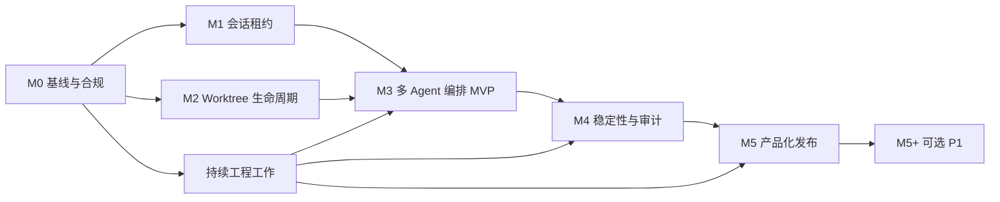

# Vizruna 开发路线图

| 项目 | 内容 |
| --- | --- |
| 文档编号 | ROADMAP-001 |
| 版本 | v0.1 |
| 状态 | Approved |
| 基准日期 | 2026-07-24 |
| 关联文档 | PRD-001、RFC-001、ACCEPTANCE-001 |

## 1. 路线图目的

本路线图把 PRD 中的产品目标和 RFC 中的技术方案拆成可以排期、验收和停止的开发阶段。它不以“功能做完”为完成标准，而以“关键风险已被验证、交付物可被验收”为完成标准。

当前工作量是基于代码调研后的区间估算，用于立项和人员安排，不是固定报价。进入 M0 后，应根据真实代码基线再进行一次逐任务估算。

## 2. 交付假设

### 2.1 建议团队配置

最小可行团队：

- 1 名桌面端/全栈负责人：Electron、React、进程通信、发布链路。
- 1 名 Agent/基础设施工程师：Pi SDK、会话、工具系统、Worktree、Provider 路由。
- 0.5 名测试工程师：自动化、回归、安装包和异常恢复。
- 0.2 名产品负责人：需求取舍、验收、企业试点反馈。
- 法务和安全人员按里程碑参与许可证、依赖和凭据审查。

如果只有 1 名工程师，应按阶段串行执行，预计需要 16–24 周；不建议同时推进终端、OAuth、跨平台和远程协作。

### 2.2 首发边界

- 首发平台：macOS Apple Silicon。
- 首发形态：本地桌面应用，不建设多租户服务端。
- 首发并发：最多 4 个活跃 Agent Worker。
- 首发语言：简体中文和英文。
- 首发模型：沿用 Pi SDK 可用 Provider；应用只负责配置、凭据引用和路由。
- 主会话数据：继续使用 Pi JSONL。
- 产品元数据：使用独立 SQLite 数据库。

### 2.3 估算口径

- 1 人日代表 1 名有相关经验工程师的完整工作日。
- 包含实现、单元测试、代码评审和必要文档。
- 不包含企业定制、模型调用费用、开发者账号审核等待时间和外部法务等待时间。
- 阶段日历时间允许并行，因此不等于人日简单相加。

## 3. 总体阶段

| 阶段 | 目标 | 预计人日 | 建议日历时间 | 退出结果 |
| --- | --- | ---: | ---: | --- |
| M0 基线与合规 | 建立可持续开发底座 | 5–8 | 1 周 | 可构建、可测试、许可证结论明确 |
| M1 会话租约 | 防止多个进程同时写同一会话 | 3–5 | 1 周 | 已完成（2026-07-25，见 M1 报告） |
| M2 Worktree 生命周期 | 为并行 Agent 提供隔离工作区 | 12–18 | 2–3 周 | 已完成（2026-07-25，见 M2 报告） |
| M3 多 Agent 编排 MVP | 实现父子 Agent 和证据回传 | 20–30 | 4–6 周 | 已完成（2026-07-25，见 M3 报告） |
| M4 稳定性与审计 | 处理失败、恢复、追踪和性能 | 10–15 | 2–3 周 | 已完成（见 M4 报告） |
| M5 产品化发布 | 完成 Provider 路由、双语、安装包和试点准备 | 12–18 | 2–3 周 | 工程完成，外部发布门禁待验（见 M5 报告） |
| M5+ 第一阶段必选增强 | 集成终端和 GUI OAuth | 7–12 | 1–2 周 | 工程候选已完成，真实授权/平台人工验收待执行 |
| 持续工程工作 | CI、测试、i18n、文档、安全 | 7–12 | 贯穿全程 | 每阶段都有自动化质量证据 |
| **P0 合计** |  | **69–106** | **10–14 周并行推进** | 内部 Alpha / 试点版 |
| **含可选 P1** |  | **76–118** | **12–16 周并行推进** | 增强试点版 |

以上日历时间成立的前提是至少两名工程师并行推进，并严格执行首发边界。若许可证结论、Pi SDK 接口或签名资质阻塞，日历时间需要顺延。

## 4. 依赖与关键路径

关键路径是：

`许可证与工程基线 → 会话单写保护 → Worktree 隔离 → Agent 编排 → 异常恢复 → 签名发布`

M1 和 M2 可以部分并行，但 M3 不应在二者尚未形成稳定契约前大规模开发。

## 5. 分阶段任务

### 5.1 M0：基线与合规

目标：把 pi-app 转换为可长期维护的产品底座，并在复制或改写 pi-gui 行为前解决许可证边界。

| 任务 | 交付物 | 完成标准 |
| --- | --- | --- |
| M0-01 固化上游基线 | 上游仓库、提交号、构建环境记录 | 任意开发者可按文档复现构建 |
| M0-02 许可证审查 | pi-app、pi-gui、Pi SDK 依赖使用结论 | 法务或负责人书面确认允许的使用方式 |
| M0-03 产品命名和目录 | 应用 ID、显示名、数据目录、协议名 | 不覆盖原 pi-app 或 Pi CLI 的用户数据 |
| M0-04 建立质量基线 | lint、类型检查、单测、打包 CI | 主分支提交自动执行并可追踪 |
| M0-05 固定 Pi SDK 版本 | lockfile、适配层、升级说明 | SDK 调用只从适配层进入 |
| M0-06 基线冒烟测试 | 启动、创建会话、模型调用、重启恢复 | 全部通过并留存测试记录 |

退出条件：

- 许可证结论不是“待确认”。
- 原始 pi-app 核心路径能够构建和运行。
- 新产品数据目录与原应用隔离。
- CI 能阻止类型错误和构建失败进入主分支。

### 5.2 M1：会话租约

目标：在引入多进程和多 Agent 之前，先建立“一个会话只能有一个写入者”的硬约束。

| 任务 | 交付物 | 完成标准 |
| --- | --- | --- |
| M1-01 租约协议 | lease 文件结构、心跳和超时规则 | RFC 中字段均有实现和测试 |
| M1-02 Main 进程仲裁 | 获取、续期、释放、强制接管接口 | Renderer 不可绕过 Main 直接写租约 |
| M1-03 Worker 集成 | Worker 启动前获取租约，退出时释放 | 无租约时拒绝写会话 |
| M1-04 崩溃恢复 | 过期检测、进程存活检查、恢复提示 | 异常退出后可安全恢复 |
| M1-05 冲突界面 | 只读、返回、接管三类用户路径 | 用户能理解风险并做出明确选择 |

退出条件：

- 同一会话被两个应用窗口或 Worker 打开时，最多只有一个写入者。
- Worker 被强制终止后，租约可在约定时间内恢复。
- 所有接管操作进入审计日志。

实施状态：M1 内部工程门禁已于 2026-07-25 通过；验证证据见 `07-M1-Session-Lease-Report.md`。Pi CLI/原 pi-app 尚不实现本租约协议，因此“外部非协作进程继续追加 JSONL”的检测仍保留为 M4 风险项，不把它误报为已解决。

### 5.3 M2：Worktree 生命周期

目标：让父 Agent 可以为子 Agent 建立真实的 Git 隔离工作区，并能安全地恢复和回收。

| 任务 | 交付物 | 完成标准 |
| --- | --- | --- |
| M2-01 仓库能力检测 | Git 仓库、裸仓库、分支和工作树检测 | 非 Git 目录有清晰降级行为 |
| M2-02 创建事务 | 分支命名、目标目录、数据库登记 | 任一步失败均可回滚或标记可恢复 |
| M2-03 生命周期状态机 | creating、ready、dirty、missing、error、removing、removed | 状态变化有审计记录 |
| M2-04 脏状态保护 | 未提交、未推送、未合并检查 | 默认不允许危险删除 |
| M2-05 恢复扫描 | 启动时对照 Git 和 SQLite 实际状态 | 孤儿目录和缺失目录均能识别 |
| M2-06 回收流程 | 归档、删除分支、删除工作树 | 高风险动作二次确认并提供命令预览 |
| M2-07 管理界面 | 列表、状态、路径、关联 Agent、操作 | 状态与命令行实际结果一致 |

退出条件：

- 在测试仓库中连续创建和回收 20 个 Worktree 无残留。
- 有未提交改动时，默认删除操作被阻止。
- 应用崩溃后重新启动，可以恢复已有 Worktree 的登记状态。

实施状态：M2 内部工程门禁已于 2026-07-25 通过；验证证据见 `08-M2-Managed-Worktree-Report.md`。已完成受管目录、事务创建、自动或自定义 Worktree/分支命名、已有分支保护、实时 Git 安全检查、明确强制确认、运行中禁止删除、启动对账、双语管理界面和 20 次连续回收测试。外部移动后的自动重新绑定、SQLite 备份/损坏重建仍保留为 M4 恢复能力，不把“已发现差异”误报为“已自动修复一切”。

### 5.4 M3：多 Agent 编排 MVP

目标：实现可控、可观察、可取消的父子 Agent 协作，而不是仅在界面上模拟多 Agent。

| 任务 | 交付物 | 完成标准 |
| --- | --- | --- |
| M3-01 Agent Worker 管理器 | 创建、启动、停止、重启、资源释放 | 单 Agent 崩溃不拖垮主进程 |
| M3-02 关系模型 | 父子关系、任务状态、会话和 Worktree 关联 | 重启后关系可恢复 |
| M3-03 编排工具 | spawn、send、wait、cancel、inspect | 工具参数有 schema 校验 |
| M3-04 消息与事件协议 | 请求 ID、事件序号、错误码、取消语义 | 重复和乱序事件可被识别 |
| M3-05 并发调度 | 默认上限 4、排队、超时和取消 | 达到上限时不再创建新 Worker |
| M3-06 证据回传 | 摘要、变更文件、测试结果、错误信息 | 父 Agent 不依赖读取子会话全文即可判断结果 |
| M3-07 任务树界面 | 层级、状态、耗时、模型、工作区和错误 | 实时状态与 Worker 状态一致 |
| M3-08 主动恢复 | 应用重启后标记中断任务并提供恢复选择 | 不把中断任务错误标记为成功 |
| M3-09 端到端样例 | 父 Agent 拆分两个代码子任务并汇总 | 能在真实测试仓库完成并给出证据 |

退出条件：

- 父 Agent 能创建两个子 Agent，在独立 Worktree 执行任务并收集结果。
- 取消父任务时，子任务和 Worker 按协议停止。
- 某个子 Agent 失败时，其他子 Agent 和主应用仍可继续工作。
- 并发上限、超时和资源回收均有自动化测试。

实施状态：M3 内部工程门禁已于 2026-07-25 通过；验证证据见 `09-M3-Multi-Agent-Orchestration-Report.md`。已完成真实 Worker/Session 控制面、默认 Worktree、六项父 Agent 工具、并发队列、递归取消、超时、重启恢复、事件去重、系统证据和双语任务树。真实外部 Provider 的双 Agent 调用将在 M5 独立路由完成后复测，不将确定性 Runtime 自动化误报为外部模型验收。

### 5.5 M4：稳定性、证据与审计

目标：把“演示可用”提高到“内部团队可以连续使用并定位问题”。

| 任务 | 交付物 | 完成标准 |
| --- | --- | --- |
| M4-01 统一错误模型 | 用户提示、内部错误码、可重试标记 | 核心错误均可定位到具体阶段 |
| M4-02 审计日志 | Agent、Worktree、会话、代理和接管事件 | 敏感值脱敏，事件可按任务查询 |
| M4-03 诊断包 | 版本、日志、状态快照、脱敏配置 | 用户可预览后导出 |
| M4-04 长时间稳定性 | 8 小时连续运行测试 | 无进程持续增长或会话损坏 |
| M4-05 故障注入 | Worker 崩溃、网络中断、磁盘错误、进程重启 | 恢复行为符合 RFC |
| M4-06 性能治理 | 启动、会话列表、事件吞吐、内存基线 | 达到验收文档阈值 |
| M4-07 数据备份 | 元数据备份和恢复工具 | 能恢复关系和登记信息，不改写 JSONL |

退出条件：

- 所有 P0 故障场景都有确定状态，不出现无限“运行中”。
- 诊断包不包含明文 API Key、Cookie、Authorization Header。
- 8 小时稳定性测试和崩溃恢复测试通过。

实施状态：M4 内部工程门禁已通过；证据见 `10-M4-Stability-Audit-Diagnostics-Report.md`。统一错误、审计查询/导出、诊断预览/脱敏、迁移备份、显式恢复、损坏备份拒绝、外部 JSONL 空闲变更检测、100 任务生命周期均通过；真实 Electron 看门狗持续运行 8.014 小时且无意外退出。

### 5.6 M5：产品化发布与可选 P1

目标：形成可安装、可升级、可面向首批试点客户使用的版本。

| 任务 | 级别 | 交付物 | 完成标准 |
| --- | --- | --- | --- |
| M5-01 Provider 配置 | P0 | Provider、模型、凭据引用和连通性测试 | 中外模型能分别选择直连或代理 |
| M5-02 代理路由 | P0 | direct、system、profile 三种模式 | 仅指定 Worker/Provider 使用指定代理 |
| M5-02A 统一新建任务 | P0 | Project、Local/Worktree、Provider、Model、Thinking、首条任务和高级选项 | PRD 7.1 字段完整，Worktree/分支可自动或自定义 |
| M5-03 终端 | 第一阶段必选 | 项目终端、Agent 工作区终端、生命周期管理 | shell 退出不影响主应用 |
| M5-04 授权体验 | 第一阶段必选 | GUI OAuth/API Key、退出和认证状态 | 回调、失败和地区限制有明确提示 |
| M5-05 中英文本 | P0 | 完整翻译、缺失键检测、语言切换 | 核心路径无硬编码用户文本 |
| M5-06 安装和签名 | P0 | Apple 签名、公证、DMG/ZIP、升级策略 | 干净设备可安装启动 |
| M5-07 使用文档 | P0 | 安装、Provider、代理、Worktree、故障排查 | 非开发人员可按文档完成首次任务 |
| M5-08 试点反馈 | P0 | 3–5 名内部或友好客户的记录 | 阻断问题关闭或有明确规避方案 |

退出条件：

- 在未安装开发工具的干净 macOS 设备上完成安装和首次模型调用。
- OpenAI 类 Provider 可通过指定代理访问，中国 Provider 可保持直连。
- 切换 Provider 不需要修改系统级代理，也不影响其他应用。
- 签名、公证、升级和卸载路径通过验收。

产品负责人已于 2026-07-26 确认 M5-03 和 M5-04 为第一阶段必选能力。两项工程实现和无凭据自动化已完成；真实 Provider OAuth、签名包和目标平台人工体验继续作为外部门禁。

实施状态：M5 仓库内 P0 工程工作已经完成；证据见 `11-M5-Productization-Report.md` 和 `15-v0.1-Completion-Audit.md`。逐 Provider direct/system/profile、HTTP/HTTPS/SOCKS5/SOCKS5H 与逐 Profile `NO_PROXY`、safeStorage 密码引用、运行中延迟换路由、统一新建任务、真实非推理代理/直连网络 E2E、中英文门禁、20 轮性能门禁、macOS 发布脚本、用户手册、发布手册和试点包均已交付。许可证书面结论、Apple 正式产物、干净设备、真实模型推理、7 天内部试运行、异常演练和试点签署保持外部待验；当前只允许内部工程候选版，不允许正式客户分发。

## 6. 持续工程任务

这些工作不能留到最后集中补做：

- 所有 Renderer 文本从第一天进入 i18n 资源。
- 所有 Main/Worker 请求从第一天使用共享类型和 schema 校验。
- 每新增一个状态机分支，同步增加失败和恢复测试。
- 每新增一个外部依赖，记录用途、许可证、版本和替代方案。
- 每个里程碑结束时更新 RFC 决策状态和风险登记册。
- 每周至少一次用最新 Pi SDK 上游变更做兼容性观察，但不自动升级。

## 7. 迭代节奏

建议使用一周一个小迭代、两周一个演示周期：

1. 周一确认本周可验收结果和风险。
2. 开发过程中，任何协议或数据归属变化先更新 RFC。
3. 周中执行自动化测试和真实仓库冒烟测试。
4. 周五演示“用户可感知的闭环”，并更新验收证据。
5. 每两周进行一次继续、缩减或停止的 Go/No-Go 评审。

## 8. Definition of Ready

任务进入开发前必须满足：

- 对应 PRD 条目和优先级明确。
- 输入、输出、异常和权限边界明确。
- 数据写入责任明确。
- 涉及外部代码时，许可证结论明确。
- 有至少一个正常验收场景和一个失败验收场景。
- 不依赖尚未决定的 P0 架构问题。

## 9. Definition of Done

任务标记完成前必须满足：

- 实现已合入受保护分支。
- 类型检查、lint、单元测试和相关集成测试通过。
- 用户可见文本具有中英文资源。
- 用户可见错误包含下一步建议。
- 新增日志完成敏感信息审查。
- 相关 PRD、RFC、验收标准和使用文档已同步。
- 测试证据能够由另一名成员复现。

## 10. Go/No-Go 决策点

| 决策点 | Go 条件 | No-Go 或降级动作 |
| --- | --- | --- |
| GATE-0 开始编码 | pi-app 商用和改造边界明确 | 暂停复制代码，改为重新实现或更换底座 |
| GATE-1 开始编排 | 租约和 Worktree 自动化测试通过 | 只发布单 Agent 能力 |
| GATE-2 进入 Alpha | 编排闭环、取消、失败恢复通过 | 限制为开发演示，不交付用户 |
| GATE-3 进入试点 | 安全、数据完整性、签名、代理路由通过 | 内部使用，不向客户分发 |
| GATE-4 扩展平台 | macOS 试点稳定并验证真实需求 | 不启动 Windows/Linux 并行建设 |

## 11. 里程碑报告模板

每个里程碑结束时只报告以下内容：

- 计划目标与实际完成结果。
- 可运行演示和安装包位置。
- 验收用例通过率及失败项。
- 新增或变化的架构决策。
- 仍开放的高风险和负责人。
- 人日消耗与下一阶段修正估算。
- 明确的 Go、带条件 Go 或 No-Go 结论。
