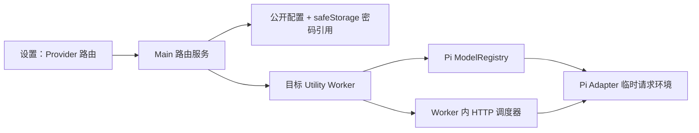

# Vizruna M5 产品化报告

| 项目 | 内容 |
| --- | --- |
| 文档编号 | M5-REPORT-001 |
| 版本 | v0.1 |
| 状态 | Conditional — engineering complete, external gates open |
| 基准日期 | 2026-07-26 |
| 关联文档 | ROADMAP-001、ACCEPTANCE-001、RISK-001 |

## 1. 结论

M5 的可由代码仓库独立完成的 P0 工程工作已经完成：

- Provider 可分别选择 `direct`、`system` 或指定 HTTP/HTTPS/SOCKS5/SOCKS5H 代理 Profile，并为每个 Profile 设置独立 `NO_PROXY`。
- 路由同时配置实际执行请求的隔离 Worker HTTP 调度器和 Pi Adapter 的临时请求环境，不修改操作系统代理、主进程或 Shell 全局环境。
- 运行中的 Agent 不会在同一回合中静默换路由；修改会延迟到当前回合结束后应用。
- 代理密码通过 Electron `safeStorage` 保存，配置、日志、审计和诊断包只保留引用或脱敏值。
- 项目行的“新建 Agent 任务”把 Project、Local/Worktree、Provider、Model、Thinking、首条任务和高级路由/并发选项收拢为单一闭环；Worktree 名称和 Git 分支可留空自动生成，也可分别自定义。
- 中英文资源完整性、占位符一致性、资源引用和核心界面硬编码中文均有 CI 门禁。
- macOS arm64 的 Developer ID 签名、公证、票据装订和 Gatekeeper 检查已固化为失败即停止的发布脚本。
- 用户手册、发布手册和 3–5 人试点执行包已经准备。
- 第一阶段增强已加入完整 PTY 多标签终端，以及 GUI Provider OAuth/API Key 登录、退出、状态和结构化失败引导。
- 当前内嵌 Pi SDK 为 npm registry latest `0.82.1`；低于 `0.82.1` 或缺少 ModelRuntime 能力的外部 SDK 不允许成为运行版本，并安全回退内嵌版。
- 正式发布证据门禁可校验候选 commit、许可证、签名公证、干净设备、真实双
  Provider、七天试运行、恢复演练、试点和四方签署；缺项或证据中出现疑似凭据
  时保持 No-Go。

当前结论是“内部工程候选版完成”，不是“已经可以对外发布”。仍需外部完成：

1. 取得 `justhil/pi-app` 源码使用的安全/法务书面结论。
2. 提供 Apple Developer ID 证书和公证凭据，生成并验证正式签名产物。
3. 在无开发环境的干净 Apple Silicon Mac 上完成下载、安装、升级和卸载验收。
4. 使用测试专用 Provider 凭据分别完成一次国际模型代理调用和中国模型直连调用。
5. 完成至少 7 天内部试运行和一次有人工记录的真实异常恢复演练。
6. 完成 3–5 名真实试点用户、关闭阻断问题并取得发布角色签署。

在上述证据齐备前，G8 和 M5-08 保持未通过，不允许把未签名包作为正式客户版本分发。

## 2. Provider 独立路由

### 2.1 用户模型

每个 Provider 独立保存一个路由：

| 模式 | 行为 | 典型用途 |
| --- | --- | --- |
| `direct` | 对该请求设置 `NO_PROXY=*`，明确绕过 Shell 中已有代理 | 智谱、Moonshot、国内自建模型 |
| `system` | 只读检测启动环境或 macOS 系统代理并传给目标 Worker | 希望跟随当前机器代理策略 |
| `profile` | 使用应用内保存的 HTTP/HTTPS/SOCKS5/SOCKS5H 代理 Profile及其 `NO_PROXY` | OpenAI、Anthropic 等国际 Provider |

显式 Profile 同时覆盖大小写代理变量。用户未填写 `NO_PROXY` 时使用不可匹配的内部哨兵，防止 Shell 中的“绕过大陆”规则把目标域名意外改回直连；填写后则按该 Profile 的规则绕过。丢失或损坏的 Profile 引用会失败关闭为 `direct`，不会继承不相关的环境代理。

### 2.2 进程边界

路由链路如下：

- Renderer 不接触代理密码明文。
- Main 不修改系统代理。
- Worker 不修改 `process.env`。它在 Pi 获取目标模型鉴权和请求头前安装该隔离进程的请求调度器，同时向仍自行读取代理变量的 Pi Adapter 合并临时路由环境。
- SOCKS Profile 在 Worker 内转换为仅监听 `127.0.0.1` 且带随机临时凭据的 HTTP 桥接端口，使 Pi SDK 中仅支持 HTTP/HTTPS 代理的传输分支也走同一路由；端口不对局域网开放，切换路由或退出 Worker 时关闭。
- 更新路由时，空闲 Worker 立即更新；运行中的 Worker 标记为 deferred，回合结束后更新。

### 2.3 连通性诊断

“测试连接”执行以下非推理检查：

1. 校验 Provider endpoint。
2. 解析 Provider 或代理主机 DNS。
3. 通过选定路由发起不带鉴权的 HTTP `HEAD`。
4. 返回分阶段结果、目标 Origin 和路由模式。

该诊断不会发送 API Key、不会发起收费推理、不会修改系统代理。HTTP 401/403 仍可证明网络链路可达；它不证明模型凭据有效。

## 3. 中英文产品质量

新增两层门禁：

1. `scripts/check-i18n.mjs`
   - 校验中英文命名空间文件一致。
   - 校验所有叶子键和 `{{placeholder}}` 一致。
   - 校验源码中的字面量 `t()` 引用真实存在。
2. `scripts/check-no-hardcoded-core-ui.mjs`
   - 使用 TypeScript AST 扫描 Renderer。
   - 阻止 JSX、按钮标题、占位符、Toast、错误等核心路径新增硬编码中文。
   - 允许翻译资源调用、日志诊断文本和用于兼容输入的匹配字符串。

当前结果：15 个命名空间、1442 个中英文叶子对齐，核心 Renderer 未发现硬编码中文 UI 文案。

## 4. 统一新建任务闭环

项目行中的“新建 Agent 任务”对话框实现 PRD 7.1：

- 项目路径只读显示。
- Git 项目可选 Local 或 Worktree；非 Git 项目禁用 Worktree 并解释原因。
- Provider 与 Model 为独立字段，模型列表随 Provider 过滤。
- Thinking、首条任务、当前 Provider 路由和最大并行 Worker 可在同一流程确认。
- Worktree 名称和分支名默认自动生成，也可分别修改。
- 自定义分支先通过 `git check-ref-format --branch`，已存在分支会被拒绝且不会被覆盖或在回滚中删除。
- “准备任务”只把首条任务填入 Composer，仍由用户复核后发送。

对话框状态保持局部，不增加第二套全局状态；模型设置、路由、并发和
Worktree 仍通过既有类型化 IPC 与目标服务落盘。

## 5. macOS 发布链路

### 5.1 已实现

- Hardened Runtime。
- 主应用与子进程 entitlements。
- Developer ID Application 证书预检。
- Apple ID、App Store Connect API Key 或 notarytool keychain profile 三类本地公证凭据。
- 发布模式强制公证最终 DMG。
- `codesign --verify --deep --strict`。
- `spctl` 对 `.app` 和 DMG 的 Gatekeeper 检查。
- `stapler validate` 对 `.app` 和 DMG 的票据检查。
- CI 只上传最终 DMG/ZIP，不发布与装订后 DMG 不一致的自动更新元数据。

### 5.2 当前外部阻断

本机为 macOS Apple Silicon，`notarytool` 可用，但钥匙串中没有有效 Developer ID Application identity，且没有注入发布 Secrets。因此：

- 未签名目录包已成功构建并通过打包应用冒烟测试。
- 发布预检按设计失败，证明不会静默产出未签名“正式包”。
- 正式签名、公证、装订、干净设备安装仍必须由凭据持有人执行。

## 6. 验证证据

已通过：

- Node.js `22.19.0` 干净依赖安装：`npm ci`；postinstall 确认 Electron 平台二进制可用，并确认 Pi SDK 嵌套运行时依赖为 `brace-expansion@5.0.8`、`protobufjs@7.6.5`
- Node.js `22.19.0` 完整仓库门禁 `npm run verify`：类型检查、全量 ESLint、i18n 门禁、286 个脚本/契约测试、290 个单元测试、生产构建、341 个生产组件 SBOM
- 新鲜 `npm audit` 与 `npm audit --omit=dev`：完整安装树和生产树均为 0 个漏洞
- Provider 路由单元测试：3 个文件、10 个用例
- Provider 路由契约测试：4/4
- macOS 发布门禁契约测试：3/3
- 桌面端 E2E：17 个通过、1 个按设计跳过；跳过项为需要显式启用的真实网络用例
- 真实网络路由 E2E：国际 Provider 走 `127.0.0.1:10808` 显式 HTTP 代理，中国 Provider 保持直连；1/1 通过
- 确定性回环网络集成：真实 `fetch` 经临时 SOCKS5 服务到达目标，随后切换 direct 不再经过 SOCKS，SOCKS5H + `NO_PROXY` 正确绕过；1/1 通过
- 生产构建
- 未签名 macOS arm64 `.app`、DMG 和 ZIP 构建
- 打包应用冷启动冒烟测试，并复核包内两项安全运行时依赖版本
- 中英文资源与核心 UI 硬编码检查
- M4 8 小时长运行：8.014 小时完成，退出码 0
- 100 次会话租约启动/退出循环：每轮有效持有者均阻止竞争实例，正常释放后下一实例立即接管，结束无残留租约
- 20 轮生产 Electron 性能门禁：
  - 冷启动 P95 `1424.42 ms`（阈值 `5000 ms`）
  - 项目/会话列表 P95 `48.14 ms`（阈值 `2000 ms`）
  - 会话切换 P95 `44.25 ms`（阈值 `1000 ms`）
  - Composer 渲染 P95 `0.20 ms`（阈值 `100 ms`）
  - Main 事件经状态更新到下一次 UI 绘制机会 P95 `17.60 ms`（阈值 `500 ms`）
  - 取消信号 P95 `2.50 ms`（阈值 `1000 ms`）
  - 冷启动空闲工作集 P95 `495.28 MiB`，相对上游 M0 的 `475.50 MiB` 增长 `4.2%`（上限 `20%`）

真实网络 E2E 不携带凭据，也不调用收费模型。它证明路由隔离，不代替真实 Provider 首次推理验收。

SBOM 从实际安装后的生产依赖树生成，而不是只读取上游 Pi SDK 的
`npm-shrinkwrap.json`。这样既能保留可追溯的依赖来源，也能准确反映 postinstall
安全修补后真正进入应用包的版本。

性能基线与候选版摘要分别见
`evidence/m0-upstream-performance.json` 和 `evidence/m5-performance.json`。

## 7. 需求完成状态

| M5 项 | 状态 | 说明 |
| --- | --- | --- |
| M5-01 Provider 配置 | 工程完成 | Provider 列表、凭据沿用 Pi、逐 Provider 路由与诊断 |
| M5-02 代理路由 | 工程完成 | direct/system/profile、HTTP/HTTPS/SOCKS5/SOCKS5H、逐 Profile `NO_PROXY`、Worker 隔离、运行中延迟应用 |
| PRD 7.1 新建任务 | 工程完成 | Project、Local/Worktree、Provider、Model、Thinking、首条任务、路由和并发；Worktree/分支自动或自定义 |
| M5-03 终端 | 工程门禁通过 | 真实 PTY、多标签、可信 cwd、切换/重载回收、有界回放和 16ms 输出批处理；真实命令 E2E 通过 |
| M5-04 GUI OAuth | 工程完成 / 外部待验 | GUI 登录/退出/状态、逐 Provider 认证路由、超时/地区/回调失败提示、Worker 安全刷新已完成；真实 Provider OAuth 待测试账号 |
| M5-05 中英文本 | 工程门禁通过 | 资源、引用、硬编码检查通过 |
| M5-06 安装和签名 | 代码完成 / 外部待验 | 缺 Apple 凭据和干净设备证据 |
| M5-07 使用文档 | 完成 | 用户手册与发布手册已提供 |
| M5-08 试点反馈 | 待真实执行 | 试点包已准备，不虚构用户反馈 |

## 8. Go/No-Go

当前决策：**内部工程候选版 Conditional Go；客户分发 No-Go。**

解除 No-Go 的最短路径：

1. 发布负责人配置 Apple Secrets，运行 `Build macOS Release Candidate`
   工作流，留存候选 Run ID、正式签名产物和哈希。
2. 测试负责人按发布手册在干净设备完成 G8。
3. 使用测试账户完成两类 Provider 的真实首轮调用。
4. 完成 7 天内部试运行、真实异常恢复演练和 3–5 人试点。
5. 产品、工程、测试和安全/法务负责人完成签署，确认随包声明完整且无 S0/S1 问题。
6. 运行 `npm run release:evidence:check`，严格结果必须为 `decision=go`。

pi-app 源码许可阻断已于 2026-07-30 由上游 MIT LICENSE 和作者确认解除，
不再列入本阶段 No-Go 缺项。
