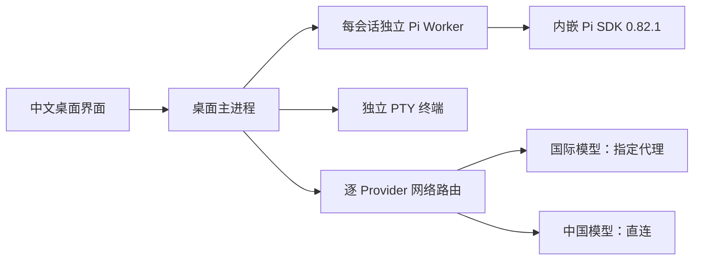

# 第一阶段中文 Pi Agent GUI：开发进度与验收说明

| 项目 | 内容 |
| --- | --- |
| 文档编号 | PHASE1-PROGRESS-001 |
| 日期 | 2026-07-26 |
| 当前形态 | macOS 本地桌面客户端工程候选版 |
| 产品底座 | `justhil/pi-app` 的进程、状态和 UI 架构 |
| Agent Runtime | 内嵌 `@earendil-works/pi-coding-agent@0.82.1` |
| 当前发布判断 | 可进入产品负责人亲自试用；尚不是正式客户发布版 |

## 1. 我们到底在做什么

我们正在做一个基于 Pi Agent 的中文桌面 GUI。它不是单独做一个网页，也不是把
两个开源项目硬拼在一起。

应用保留 `pi-app` 已经稳定的桌面进程、会话状态、文件工作台和中文界面，再把
`pi-gui` 中有价值的业务行为，按同一套架构重新实现。Pi 仍负责 Agent、模型、
工具、Skills、会话和认证语义；本产品负责把这些能力变成普通用户可操作、可观察、
可恢复的桌面工作流。



## 2. 第一阶段最终目的

第一阶段不是“代码能启动”就结束，而是交付一个由产品负责人亲自认可、真正好用的
中文 Pi Agent GUI。至少要做到：

1. 不进入命令行也能打开项目、选模型、登录 Provider、创建任务和查看结果。
2. OpenAI 等国际 Provider 可以单独走 V2RayN 代理，中国 Provider 可以单独直连。
3. 登录和模型请求都不修改系统全局代理，不影响浏览器、其他终端或其他软件。
4. 保留一个完整的内嵌项目终端，方便需要命令行时直接使用。
5. 支持会话树、文件、Diff、Review、Worktree 和多 Agent，并能在异常后恢复。
6. 使用经过产品测试的 Pi 版本；升级不能把用户变成兼容性测试者。

## 3. 已经完成什么

| 能力 | 当前状态 | 用户能得到什么 |
| --- | --- | --- |
| 中文桌面底座 | 已完成 | 中文核心界面、设置、文件、会话、任务和错误提示 |
| Pi 内嵌运行 | 已完成 | 无需另开 Pi CLI；应用内 Worker 直接使用 Pi SDK |
| SDK 版本策略 | 已完成 | 当前内嵌 npm latest 0.82.1；旧版或能力不兼容时自动回退 |
| 国内外模型路由 | 已完成 | 每个 Provider 独立选择直连、系统或代理 Profile |
| GUI Provider 登录 | 工程完成 | 账号登录、API Key、浏览器/设备码交互、退出和状态查看 |
| 登录失败解释 | 工程完成 | 显示失败类别、当前路由和下一步，不再只说“登录失败” |
| 完整内嵌终端 | 工程完成 | 真实 PTY、多标签、窗口尺寸适配、项目/Worktree 正确 cwd |
| 终端稳定性 | 工程完成 | 有界回放、输出批处理、切项目/重载/崩溃回收，不挤占 Agent Worker |
| Worktree 与多 Agent | 已完成 | 子任务隔离、队列、停止、追问、恢复和证据查看 |
| 安全与诊断 | 已完成工程闭环 | 类型化 IPC、可信目录、凭据脱敏、诊断预览、备份恢复 |

OAuth 凭据仍由 Pi 的 AuthStorage 管理。应用自己的 SQLite、Renderer 状态、日志和
诊断包不保存明文 Token。认证改变后，空闲 Worker 会安全刷新；正在运行的 Agent
回合不会为了刷新登录状态被强制中断。

## 4. 当前自动验收结果

| 门禁 | 结果 |
| --- | --- |
| TypeScript | 通过 |
| ESLint | 通过 |
| 中英文完整性 | 15 个命名空间、1511 个叶子键通过 |
| 脚本/契约测试 | 288 通过 |
| 单元测试 | 303 通过 |
| 生产构建 | 通过 |
| 桌面 E2E | 19 通过；1 个真实网络测试按环境开关跳过 |
| 生产 SBOM | 345 个组件，可重复生成 |
| macOS arm64 打包/包内启动冒烟 | 通过；当前产物未签名、未公证，仅供本机工程验收 |
| 内嵌终端真实命令 | 通过 |
| GUI 登录入口 | 通过桌面 E2E |

这证明工程候选版已经形成闭环，但不等于真实 OpenAI 账号、真实中国模型、签名 DMG
和不同用户设备都已经验收。

## 5. 还没有完成什么

### 需要产品负责人亲自确认

- 中文信息层级、按钮位置和日常操作是否顺手。
- 新建任务、Provider 登录、终端、文件和 Review 是否符合真实使用习惯。
- 哪些高级设置应继续隐藏，哪些应放到首屏。

### 需要真实账号或外部环境

- 用测试专用 OpenAI/Codex 账号，通过 V2RayN Profile 完成一次真实 GUI OAuth。
- 切换到一个中国模型 Provider，确认同一应用内直连并完成一次真实回复。
- 模拟或实际记录地区限制、OAuth 回调失败和超时的用户体验。
- 在干净 Mac 上验证正式签名、公证、安装、升级和卸载。
- 进行至少 7 天内部使用和 3–5 人试点。

### 仍不属于第一阶段正式承诺

- Windows/Linux 正式发行。
- 企业 SSO、RBAC、多租户和集中管理后台。
- 远程 Worker、计费、额度和云端审计中心。
- 对不可信代码或第三方扩展提供操作系统级沙箱。

## 6. 为什么保留内嵌 Pi 0.82.1

2026-07-26 直接查询 npm registry 时，`0.82.1` 是
`@earendil-works/pi-coding-agent` 的 latest。当前 GUI 的 ModelRuntime、会话运行时
重建和认证刷新已经按这个版本测试。

因此当前策略是：默认使用内嵌 0.82.1，同时保留外部/独立 SDK 切换能力。只有版本
不低于 0.82.1，并且实际导出本产品需要的 ModelRuntime 能力时才允许加载；否则界面
会说明原因并回退内嵌版。未来新版本要先跑完整回归，再提升默认版本。

## 7. 本地启动

项目目录：`<你的项目目录>/vizruna`

首次或依赖变化后：

```bash
cd <你的项目目录>/vizruna
npm ci
```

开发模式启动：

```bash
npm run dev
```

当前未签名工程候选包：

- `dist/Vizruna-0.1.0-alpha.1-arm64.dmg`
- `dist/Vizruna-0.1.0-alpha.1-arm64.zip`

它们不是客户正式安装包。没有 Apple Developer ID 和公证证据时，不应绕过
Gatekeeper 对外分发。

运行完整仓库门禁：

```bash
npm run verify
npm run test:e2e
```

## 8. 建议的第一次人工验收顺序

1. 启动应用并打开一个测试项目。
2. 确认中文主界面、会话、文件、Review 和新建任务流程。
3. 为 OpenAI 配置 V2RayN Profile，并在 Provider 登录行确认显示的是该路由。
4. 完成一次 OpenAI/Codex GUI 登录和简单任务。
5. 把中国 Provider 设为直连，完成一次简单任务。
6. 打开右侧“终端”，执行 `pwd` 和一条无副作用命令；新建、关闭和重新打开标签。
7. 创建一个 Worktree 任务，确认 Agent、终端和文件视图都指向正确目录。
8. 记录“不理解、找不到、步骤多、提示不明确”的地方，作为下一轮产品调整清单。

第一阶段下一里程碑不是继续堆功能，而是完成上述真实账号和产品负责人体验验收，
把工程候选版收敛为可供 3–5 人试用的签名候选版。
