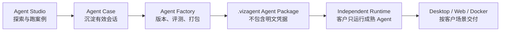

# Vizruna：Agent Studio → Agent 工厂 → 独立 Runtime 产品路线

| 项目 | 内容 |
| --- | --- |
| 文档编号 | STRATEGY-001 |
| 版本 | 1.0 |
| 日期 | 2026-07-30 |
| 状态 | Approved |
| 当前阶段 | Agent Studio |

## 1. 一句话定义

Vizruna 前期是创始人和合作伙伴使用的 **Agent Studio**，中期是把有效做法持续验证、版本化和打包的 **Agent 工厂**，后期通过独立 **Runtime** 把成熟 Agent 安全地交付给客户。

这不是三套互不相关的软件，而是一条资产逐步成熟的流水线：

## 2. 为什么按这条路线开发

### 2.1 前期先解决“做出来”

前期的不确定性来自真实业务，而不是软件功能数量。Studio 应让少量高频使用者快速：

- 选择国内外模型并配置独立网络路由；
- 运行单 Agent 或多 Agent 任务；
- 使用文件、终端、Review、Worktree 和会话树完成工作；
- 把真正有效的会话沉淀成 Agent 案例；
- 回到原会话继续改进，而不是每次从零开始。

### 2.2 中期解决“可重复”

一个演示成功的 Agent 还不是产品。Agent 工厂需要把案例变成可比较的版本，并通过固定输入和验收标准证明它能稳定复现结果。

### 2.3 后期解决“可交付”

客户通常不需要完整开发工作台，也不应接触研发会话、调试终端和开发凭据。独立 Runtime 只加载经过批准的 Agent Package，提供更小的操作面、更明确的权限和更稳定的升级方式。

## 3. 三个产品层的边界

| 层 | 主要用户 | 核心任务 | 可以做什么 | 不应该做什么 |
| --- | --- | --- | --- | --- |
| Agent Studio | 创始人、合作伙伴、Agent 顾问 | 探索、开发、跑案例 | 自由对话、文件操作、终端、多 Agent、调试、沉淀案例 | 承诺客户级稳定性或隐藏所有工程细节 |
| Agent Factory | 内部产品与交付团队 | 验证、版本化、打包 | 测试集、评测、版本比较、审批、依赖检查、生成包 | 直接携带个人 Token 或依赖某台开发电脑 |
| Independent Runtime | 客户操作员、业务用户 | 运行成熟 Agent | 安装包、参数输入、受控执行、日志、结果导出、升级 | 开放任意开发权限、暴露研发历史或默认允许任意工具 |

## 4. 核心资产模型

### 4.1 Agent Case（当前开始实现）

Agent Case 是“值得继续投入的一次有效实践”，当前字段包括：

- 名称、说明和标签；
- 待验证、已验证、已归档状态；
- 原工作区和原 Pi 会话引用；
- 当时使用的模型和思考等级；
- 创建和更新时间。

Agent Case 只保存索引和产品元数据，不复制完整对话正文，不保存 API Key、OAuth Token、Cookie 或代理密码。原始对话继续归 Pi JSONL 管理。

### 4.2 Agent Version（Factory 阶段）

一个案例经过整理后才能产生版本。版本至少应冻结：

- Agent 指令和可变参数定义；
- Skills、工具、扩展和依赖版本；
- Provider 能力要求，而不是个人账号；
- 文件模板和知识资产清单；
- 权限声明和网络访问声明；
- 测试集、验收阈值和评测结果；
- 变更说明、负责人和审批状态。

### 4.3 Agent Package（Factory 到 Runtime 的契约）

建议使用 `.vizagent` 作为逻辑包格式。早期可以是 ZIP 容器，内部至少包含清单、版本、资产、依赖、权限和测试证据。包必须满足：

- 不包含开发者个人凭据；
- 不包含未经确认的绝对本机路径；
- 有格式版本和完整性校验；
- Runtime 能在安装前解释所需权限和 Provider；
- 包的执行行为可审计，升级和回滚有明确版本。

## 5. 分阶段版本规划

### 5.1 Studio Alpha（现在）

目标：自己和合作伙伴每天真的愿意使用，并能连续产出案例。

| 版本切片 | 能力 | 完成定义 |
| --- | --- | --- |
| alpha.2 | 中文 Pi GUI、模型与授权、独立路由、文件/Review、终端、多 Agent | 核心 Agent 工作流可用 |
| alpha.3 | Agent Case 第一闭环 | 当前对话可沉淀、列出、验证、归档并重新打开 |
| alpha.4 | 案例详情与复测 | 固定目标、输入样例、产出文件和人工验收记录可关联 |
| alpha.5 | Studio 试用收敛 | 3–5 名合作伙伴连续使用，阻断问题关闭 |

### 5.2 Factory Beta

目标：同一 Agent 能被重复验证、比较并生成可移交包。

建议顺序：

1. Agent Definition 与版本快照；
2. 测试集、基线输出和人工/自动评测；
3. 依赖、权限、模型能力和成本声明；
4. 版本比较、批准和冻结；
5. `.vizagent` 导出、校验和重新导入；
6. 在隔离环境中做一次交付前验收。

### 5.3 Runtime 1.0

目标：客户不安装 Studio，也能稳定运行被批准的 Agent。

Runtime 首版只承诺一个经过真实客户场景验证的交付形态，不同时启动桌面、Web、Docker 三条线。优先形态由首批付费场景决定：

- 本地数据和人工操作较多：优先 Desktop Runtime；
- 团队共享、审批和集中更新较多：优先 Web Runtime；
- 后台批处理、系统集成较多：优先 Docker/Service Runtime。

## 6. 当前 alpha.3 的开发边界

本轮实现的是 Agent Case 的最小可用闭环：

- 在主侧栏进入“Agent 案例”；
- 把当前有效对话保存为案例；
- 查看案例及原项目、模型、标签和状态；
- 标记待验证/已验证；
- 归档和恢复；
- 一键重新打开原对话继续工作；
- 案例数据进入既有 SQLite、迁移备份和审计体系。

本轮明确不做：

- 把案例直接称为可销售产品；
- 复制或导出完整对话；
- `.vizagent` 导出；
- 自动评测、版本比较和审批流；
- 客户 Runtime；
- 云端案例同步和多租户权限。

## 7. 关键架构原则

1. **一个事实来源**：对话正文由 Pi JSONL 管理，Vizruna SQLite 管理产品索引、关系和审计。
2. **凭据不进入资产**：Studio 登录状态、API Key 和代理密码不能被 Agent Case 或 Agent Package 携带。
3. **先链接后快照**：Case 先链接源会话；只有进入 Factory 版本冻结时，才按明确清单复制必要资产。
4. **Studio 与 Runtime 解耦**：Runtime 通过版本化包契约消费资产，不直接读取开发机内部数据库。
5. **按场景选择运行形态**：不提前为所有平台建设一套巨大通用 Runtime。
6. **每次成熟都有证据**：从待验证到已验证、从版本到批准包，都必须能解释由谁、用什么输入、依据什么结果完成。

## 8. 下一步顺序

alpha.3 完成人工验收后，下一轮只做与“复测案例”直接相关的能力：

1. 为案例补充目标、输入样例、预期产物和验收清单；
2. 允许从同一案例启动一次复测运行；
3. 保存复测结果和产物引用；
4. 有至少两次成功复测后，再设计 Agent Version；
5. 在真实案例未稳定前，不启动独立 Runtime 工程。
