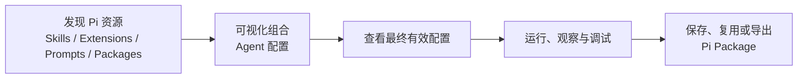

# Vizruna：Pi-native Agent Harness 升级路线

| 项目 | 内容 |
| --- | --- |
| 文档编号 | STRATEGY-002 |
| 版本 | 1.0 |
| 日期 | 2026-08-12 |
| 状态 | Completed |
| 完成范围 | alpha.6 → v0.2.0-alpha.20 |

## 1. 产品定位

Vizruna 是面向 Pi Agent 的可视化、可组合、本地优先的轻量 Agent Harness。它不以
复刻 Codex、Claude Code Desktop 或其他大型通用 Coding Agent 为目标，而是围绕 Pi
原生 SDK、Provider、会话、Skills、Extensions、Prompt Templates 和 Pi Packages
进行深度开发。

一句话目标：

> 让普通用户不写配置文件也能正确使用 Pi，让高级用户更快地组合、观察、调试和复用
> Pi Agent。

`Agent Studio → Agent 工厂 → 独立 Runtime` 保留为资产成熟和商业交付路径，但不再
充当当前 GUI 的产品定义。当前产品首先必须成为真正懂 Pi 的 Harness。

## 2. 设计原则

1. **Pi 是事实来源**：模型、认证、会话、工具和资源加载结果继续来自 Pi Runtime；
   Vizruna 不维护一套平行的 Agent 协议。
2. **先解释，再配置**：用户应先能看到当前会话最终加载了什么，再开放更复杂的组合
   和修改能力。
3. **按会话观察**：检查后台会话时不得借用前台 Worker 状态，未加载的资源必须明确
   标记为“已配置”而不是“已加载”。
4. **兼容 Pi CLI**：Skills、Extensions、Prompts、Packages 和 JSONL 保留 Pi 原生目录、
   设置和分发方式。
5. **本地优先**：Runtime、凭据、项目文件和终端继续只在用户电脑上运行。
6. **轻量和可替换**：大型功能按需加载；不为了追赶通用 Agent 产品而引入移动端、
   远程协作或第二套全局状态模型。

## 3. 目标信息架构

工作台保持三栏结构：左侧组织项目、会话和 Agent 配置，中间显示对话与工具执行，右侧
承载 Review、Run、Pi、Context、Tree、文件和终端等检查视图。OMPChamber 只作为信息
层级、工具折叠和检查面板的交互参考，不引入其多模型竞赛、远程设备和完整 GitHub
控制台路线。

## 4. 版本顺序

### 4.1 alpha.6 — Harness Shell

目标：用户能回答“这个会话为什么会这样运行”。

- 新增右侧 **Pi 有效配置**检查器；
- 展示 Pi Runtime 版本、模型、思考强度、认证和 Provider 网络路线；
- 展示会话绑定的 Agent/提示词不可变快照；
- 展示 System Prompt、APPEND_SYSTEM 和项目上下文来源；
- 展示当前 Worker 真正加载的工具、Skills、Extensions、Prompt Templates 和 Packages；
- 区分“已配置、已加载、已禁用、加载失败”；
- 未加载的历史会话可以显示持久化模型和思考强度，但不得伪造运行时资源；
- 复用既有三栏工作台，并继续收敛 Pi 相关入口的信息层级。

### 4.2 v0.2.0-alpha.1 — Pi Native

目标：把分散设置整合为统一 Pi 资源中心。

- 全局与项目资源分层；
- Package 的 npm、Git、本地来源及版本；
- 全局/项目安装、更新、启停和移除；
- Package 内 Skills、Extensions、Prompts、Themes 清单；
- Extension 工具、命令、兼容等级和加载错误；
- 项目信任和本机代码执行风险提示；
- Pi `0.84.x` 兼容迁移，以自动兼容报告通过为升级条件。

### 4.3 v0.2.0-alpha.2 — Agent Composer

目标：Agent 配置成为 Pi 原生资源的可视化组合，而不只是 System Prompt 表单。

- 组合 System Prompt、模型、思考强度和基础工具；
- 引用 Skills、Extensions、Pi Packages 和 Prompt Templates；
- 声明工具权限、项目上下文和 Provider 能力要求；
- 创建会话前预览最终有效配置；
- 会话创建时继续保存不可变快照；
- 优先导出为 Pi 兼容 Package，只有客户交付出现明确缺口时再扩展 `.vizagent`。

### 4.4 v0.2.0-alpha.3 — Evaluation Loop

目标：用户可以用相同任务判断 Agent 改版后是否真的更好。

- 一个评测集绑定一个 Agent 配置，保存多条固定任务和人工验收标准；
- 从真实 Agent 案例的 Pi JSONL 最后一轮采集评测证据，不另造运行协议；
- 每次运行冻结 Agent 不可变快照与 SHA-256 指纹，支持同一任务的版本对比；
- 对比正文输出、模型、耗时、Token、成本、工具调用和失败，不保存隐藏思考；
- 质量结论由用户标记为通过、不通过或待复核，首版不调用另一个模型自动打分；
- 从固定任务可直接以绑定 Agent 创建新对话，完成后沉淀案例并加入评测集。

### 4.5 v0.2.0-alpha.4 — Agent Version Gate

目标：把可编辑 Agent、真实评测和可交付 Pi Package 串成可审计的发布链路。

- Agent 每次保存后按规范化配置生成稳定 SHA-256 身份；配置没有实际变化时不制造新版本；
- 版本配置不可修改，生命周期只允许从候选推进到已验证和已发布；
- 历史版本可以直接启动新 Pi 会话，评测集固定绑定具体版本而不是可变 Agent；
- 版本差异覆盖 System Prompt、模型、思考度、工具、Pi 资源和 Provider 能力要求；
- 只有同一版本通过评测集全部固定任务且输入未漂移，才可标记为已验证；
- Pi Package Studio 只导出已验证版本，并把版本号、摘要和版本目录写入交付物。

### 4.6 v0.2.0-alpha.5 — Version Outcome Comparison

目标：让用户用同一把尺子判断 Agent 新版本是否真的更好，而不是只比较配置差异。

- 从任意版本评测集一键复制固定输入、人工验收标准、标签和顺序到另一不可变版本；
- 复制过程使用单一数据库事务，不复制历史运行，避免新版本借用旧证据；
- 按规范化任务内容配对两个版本，每个任务只取最新真实运行，避免重复试跑扭曲结果；
- 质量变化以人工通过/不通过和 Prompt 是否一致为主，耗时、Token、成本、模型和工具失败
  只作辅助信号；
- 输出进步、持平、退化、混合结果和证据不足五种整体结论，并展示每个任务的原因；
- 缺运行、待复核、Prompt 漂移或任务不一致时保守标记证据不足，不调用模型自动裁判。

### 4.7 v0.2.0-alpha.6 — Background Regression Runner

目标：把“手动逐项运行、归档案例、再挂回评测集”缩短为一次明确授权的真实回归。

- 一键在隔离后台 Pi 会话中串行运行评测集全部固定任务，不抢占当前聊天；
- 每个会话绑定目标不可变 Agent 版本，并继续使用 Pi 原生模型、工具和资源加载链路；
- 直接从 Pi JSONL 最后一轮冻结评测证据，不为了测试污染 Agent 案例库；
- 批次和任务进度持久化，支持取消、单项失败隔离、30 分钟单任务超时与重启失效说明；
- 运行前明确提示真实 API 用量与工具副作用，结果仍必须由用户人工验收；
- 完成后自动刷新版本效果对比，不引入模型自动裁判或并发压测。

### 4.8 v0.2.0-alpha.7 — Regression Report

目标：把版本判断从屏幕状态变成可保存、可分享、可审计的本地证据。

- 从当前基线与候选版本生成 Markdown 报告，结论严格复用相同的版本比较函数；
- 报告包含不可变版本号和摘要、发生变化的配置字段、人工结论和运行指标差值；
- 默认可分享摘要不包含 System Prompt、固定输入全文、模型输出全文、会话路径或隐藏思考；
- 用户可显式授权包含任务输入、验收标准与两个版本的输出，用于可信内部复盘；
- 任何模式都不导出凭据、System Prompt、会话文件路径或隐藏思考；
- Local Web 直接下载 Markdown，文件生成留有脱敏模式与比较结论审计记录。

### 4.9 v0.2.0-alpha.8 — Validation Readiness Gate

目标：确保候选版本只有在自身证据完整、且相对最近已验证版本没有退步时才能晋级。

- 首个版本必须有固定任务，并由当前精确版本使用原始输入全部运行和人工通过；
- 已存在更早的已验证/已发布版本时，候选评测集必须明确关联最近的已验证基线；
- 版本验证与比较页复用同一套进步、持平、退步、混合和证据不足判断；
- 只有进步或持平可以晋级，退步、混合、证据不足、Prompt 漂移或待复核均阻止验证；
- 门禁只读取每个任务当前精确版本的最新运行，旧通过结果不能覆盖更新的失败证据；
- 版本历史在操作前展示就绪状态和逐项阻断原因，Main Runtime 在真正写入状态前再次强制校验。

### 4.10 v0.2.0-alpha.9 — Agent Asset Catalog

目标：在同一目录里区分正在迭代的 Agent、已有验证证据的成熟资产和已经导出的交付版本。

- 资产视图从不可变 Agent Version 推导，不另建一套人工维护的成熟度状态；
- “开发中、成熟 Agent、交付版本”允许重叠：最新候选不会隐藏更早的已验证/已发布版本；
- 展示当前最新版本、最近成熟版本和最近交付版本，支持按三种资产视角筛选；
- 已发布只代表曾成功导出；当前项目还会核验受管 Pi Package 的必需文件和不可变身份；
- 明确区分 Package 可用、文件缺失、元数据无效、未导出和未打开可信项目无法核验；
- 版本验证或 Package 导出后实时刷新目录，不要求重新进入页面。

### 4.11 v0.2.0-alpha.10 — Delivery Readiness Manifest

目标：把“Vizruna 可以安全导出这个 Agent”和“另一台机器已经具备运行条件”明确拆开。

- 在 Main Runtime 聚合版本验证、Pi Runtime、固定模型、Provider 授权、Pi Packages、
  Pi 资源、项目上下文和工具策略的真实状态，Renderer 不重复猜测；
- 目标环境结果分为已就绪、需要配置和被阻断，缺失模型/资源等硬依赖不会被普通提示掩盖；
- Provider 登录和外部依赖属于目标机器操作，不阻止生成安全交付包，也不会复制本机凭据；
- 每个标准 Pi Package 同步生成双语 `DELIVERY_CHECKLIST.md`，冻结 Agent Version、摘要、
  Runtime 要求、逐项检查结果和目标机器复现步骤；
- `vizruna-agent.json` 同步保存交付证据，落盘前同时校验不可变版本和清单身份。

### 4.12 v0.2.0-alpha.11 — Package Import & Local Reproduction

目标：让接收方把标准 Pi Package 变成本机可检查、可配置、可重新验证的 Agent 资产。

- 导入路径必须位于当前活动可信项目，限制文件数量、类型和大小，并核验 Package manifest、
  五个受管文件、Profile/Version 归属及配置 SHA-256；
- 目标环境就绪度全部根据接收机器重新计算，来源清单仅作交付证据，不替代本机事实；
- Pi Package 依赖按其声明作用域安装，资源选择按 Package source、资源类型和名称重映射到
  本机 Pi ID，无法映射时继续显示阻断；
- 用户分别确认“安装依赖、安装 Agent Package、加入配置库”，不会隐式执行第三方代码；
- 配置导入创建带持久来源溯源的本地候选分支，而不是复制 validated/released 状态；本机
  重新通过 Evaluation Gate 后才成为成熟 Agent；
- Provider 登录、API Key、OAuth Token 和代理密码永不进入导入流程。
- 导入后不只陈列缺失项：就绪检查将授权、Pi 资源、Agent 上下文/工具策略与候选版本评测
  映射到现有 Harness 页面；OAuth 成功后自动复检，进入 Evaluation Studio 时预选导入的
  Agent 与本地候选版本。

### 4.13 v0.2.0-alpha.12 — Agent Lifecycle Workspace

目标：把分散的配置、版本、评测和交付能力收敛到单个 Agent 的连续工作上下文。

- Agent 卡片进入专属工作台，不要求用户在多个顶层页面之间记忆同一资产；
- 生命周期只从不可变版本、评测验证和本地 Package 证据推导，不增加人工成熟度标签；
- 配置摘要区分 Agent 固定值与 Pi Runtime 继承值，避免把继承项伪装成可复现配置；
- 候选版本引导建立评测，成熟版本引导 Package 交付，已交付版本继续运行与复验；
- 版本、评测和 Package 操作复用既有 Runtime，不引入第二套业务状态；
- 工作台聚合绑定该 Agent 的案例、当前版本评测集、固定任务和每个任务最新运行；旧通过
  证据不会覆盖较新的失败，验证门禁阻断原因直接在 Agent 上下文中解释；
- 下一步按真实缺口依次引导建立评测集、添加任务、补跑、人工复核、修复阻断、验证和交付；
- 证据区提供唯一上下文主操作，并定位到当前评测集、版本证据或 Package；它不会绕过人工
  复核、版本验证确认、第三方代码安装确认或目标环境交付检查；
- 本地运行预检每次从 Pi Runtime 重算模型授权、Provider 能力、显式 Pi 资源、项目上下文
  和工具策略；继承项标为环境依赖，缺失的显式资源与模型授权标为阻断；
- Main Runtime 在会话快照落盘前再次拒绝缺失/禁用的显式 Package、Skill、Extension 或
  Prompt，避免从其他入口启动时形成“成功运行但少了能力”的假成功；
- 当前 Agent 工作上下文使用页面会话级状态保存：进入 Pi 设置或资源中心修复后返回仍定位
  同一 Agent，只有用户明确返回配置库时清除；不写入长期产品偏好或 Agent 数据；
- OAuth 完成自动重算预检，每个阻断检查项提供独立修复入口，同时保留手动重新检查；
- 视觉层级借鉴 OMPChamber 的对象工作台，但不引入多模型竞赛和远程控制。

### 4.14 v0.2.0-alpha.13 — Agent Run Evidence Chain

目标：让一次真实 Pi 运行自然成为可追溯、可复用的 Agent 资产，而不是散落在聊天历史里。

- 运行索引复用 Pi 本地 JSONL 会话和既有不可变 Agent Binding，不创建第二份聊天正文；
- 每条运行同时显示 Agent Version、模型/思考度、运行状态、最后失败证据、消息数和产物；
- 活跃状态来自 Worker Runtime，历史错误和文件来自 Pi 时间线，案例关系来自本地案例库；
- 从工作台可以打开准确的源会话，或把真实运行一键沉淀为带溯源信息的 Agent 案例；
- 加入评测时，先确保该运行成为案例，再为当前不可变版本建立固定任务并绑定真实运行证据；
- 没有当前版本评测集时，仍遵循既有生命周期，引导先建立评测集而不绕过版本门禁。

### 4.15 v0.2.0-alpha.14 — Agent Run Desk

目标：借鉴 OMPChamber 的对象工作台层级，让用户围绕一次 Pi 运行查看证据，而非阅读卡片流。

- 左侧选择同一 Agent 的运行记录，右侧保持当前运行的完整对象详情；
- 详情集中显示不可变版本、模型、思考度、状态、失败原因、消息数、文件和案例；
- 点击文件产物进入既有 Review 面板，复用工作区路径安全边界和默认应用入口；
- 源会话导航仍定位真实 Pi JSONL，会话与 Agent 工作台不复制彼此状态；
- 支持选择一条基准运行，比较状态、消息数和文件数，用于快速发现变化；
- 比较不是多模型竞技场，不引入排行榜、并排对话或新的模型执行抽象。

### 4.16 v0.2.0-alpha.15 — Pi Capability Manifest

目标：让用户明确知道一个 Agent 为什么具备某项能力，以及换环境后会缺少什么。

- 清单直接来自 Agent Profile Preview 和 Pi PackageManager 解析结果，不维护第二套资源目录；
- 按基础工具、Pi Packages、Extensions、Skills、Prompt Templates 和项目 Context 分组；
- 每项资源展示 Package/顶层来源、用户级/项目级作用域和当前解析状态；
- Extension 同时展示静态注册的工具名，避免“安装了扩展但不知道增加了什么能力”；
- 继承项明确标记为当前环境决定，缺失 Package、缺失/禁用资源和不可信 Context 标为阻断；
- 工作台提供统一 Pi 资源中心入口，安装、过滤、启停和热重载继续由 Pi 原生管理器负责。

### 4.17 v0.2.0-alpha.16 — Runtime Capability Evidence

目标：回答“配置写了什么”和“这次 Pi 实际加载了什么”是否一致，以及结果变化是否由能力漂移引起。

- `agent_start` 时从真实 `AgentSession` 捕获工具、Skills、Extensions、Prompt Templates、
  Context 文件和 System Prompt 来源，并保存运行前 Context 快照；
- `agent_end` 时追加运行后 Context 快照，开始证据不会被结束事件覆盖；
- 证据按 Pi session file 持久化，重启 Vizruna 后仍能从 Agent Run Desk 查看；
- 对照的是创建会话时冻结的 Agent Snapshot，而不是后来编辑过的当前配置；
- 固定策略报告匹配、缺失和额外加载项；继承策略只记录实际值，不制造错误漂移；
- 旧运行没有 Runtime 证据时显示不可判断，不从当前环境反推历史事实。

### 4.18 v0.2.0-alpha.17 — Pi Run Health & Usage Evidence

目标：让 Agent Run Desk 不只说明加载了哪些能力，还能用 Pi 原生证据解释一次运行的资源消耗与风险。

- 从当前 Pi 分支时间线汇总输入、输出、缓存读写 Token 和实际费用，不另造计费模型；
- 统计真实工具调用、失败调用和每个工具的调用次数，并对照运行时已加载工具列出“加载但未调用”；
- 将运行开始/结束 Context 快照转成占用率与 Token 增量，超过 75%/90% 分级提醒；
- 显示 Context 压缩、单轮显著增长和工具失败信号，不使用 LLM 对运行健康度作主观判断；
- 最多分析当前分支最近 500 条时间线记录；长会话明确标为抽样，绝不伪装成完整统计。

### 4.19 v0.2.0-alpha.18 — Per-turn Pi Evidence Timeline

目标：把会话级概览下钻成不会互相覆盖的逐轮运行证据，回答“问题从哪一轮开始”。

- 以 `session_file + run_id` 为唯一键保存每次 Pi `agent_start` 到 `agent_end` 的事实；
- 每轮独立冻结开始/结束 Context、真实加载资源、Token/费用、工具调用与失败、压缩、文件和错误；
- `failed` 后到达的 `idle` 只负责关闭时间边界，不会把失败误改成成功；
- Agent Run Desk 按发生顺序展示最近 50 轮，可展开检查单轮持续时间、Context 增量、缓存、费用、工具、文件与错误；
- 老会话明确显示尚无逐轮证据；只从升级后的下一次运行开始记录，不从当前状态伪造历史。

### 4.20 v0.2.0-alpha.19 — Evidence-based Run Comparison

目标：把 OMPChamber 式对象并排思路用于 Agent 调优，但比较 Pi 运行证据而不是做模型竞技场。

- 两次运行并排比较不可变 Agent 版本、模型、思考度和 Runtime 实际能力；
- 统一比较消息、文件、输入/输出 Token、费用、工具调用/失败、Context 占用/增量和压缩次数；
- 对实际能力列出新增和移除项，只有两侧都有 AgentSession 证据时才允许比较；
- 用确定性阈值标记 Context 压力、工具失败、费用和 Token 上升等关注信号，不调用模型生成“原因”；
- 明确提示证据不完整，并在界面声明变化只代表相关事实，不能直接证明结果变化的因果。

### 4.21 v0.2.0-alpha.20 — Evidence-to-Action Diagnosis

目标：把 Run Desk 已发现的问题连接到准确处理入口，而不自动修改 Agent。

- 用固定优先级诊断运行失败、固定能力缺失/额外加载、Context 高压、工具失败、压缩和抽样证据；
- 每条问题展示观测事实、严重度和建议检查位置，不调用模型猜测根因；
- 当前唯一主操作按运行失败、能力缺失、Context 临界等顺序决定；
- 操作只打开原运行、重新运行、Pi 资源中心或 Agent 配置，不执行隐式修复；
- 旧运行缺少证据时只建议重新建立证据，不从今天的环境补写历史结论。

## 5. 实施完成状态

alpha.6 至 alpha.20 的既定 Harness 升级已经进入工程：

- 已新增只读、按会话定位的 Pi Inspector 契约和聚合服务；
- 已接入 Local Web IPC 白名单和右侧 Pi Tab；
- 已展示 Runtime、配置快照、上下文来源与五类运行资源；
- 已实现配置异常提示和中英文界面；
- 已补充聚合逻辑、右侧面板默认值、类型、i18n 和生产构建门禁；
- 已通过真实历史会话浏览器验收、Local Web E2E、聚合逻辑单测和完整工程校验；
  活动 Worker 与更多第三方 Package 组合继续作为后续兼容样本积累。
- 已新增统一 Pi 资源中心，总览和 Packages 数据直接来自 Pi `SettingsManager` 与
  `DefaultPackageManager`，并按用户级/项目级展示安装状态、过滤规则和资源构成；
- 已把 Skills、Extensions、Pi Prompt/Context 和 Themes 收敛到资源中心，同时把
  Agent Studio 的系统提示词库拆回独立入口；
- 已修复旧 Skills 页面无法发现 `~/.agents/skills` 和 Package Skills 的问题，并从
  Pi Inspector 提供直达资源中心的管理入口；
- 已接通 Pi Package 的用户级/项目级安装、缺失补装、单包更新、可用更新检查与移除；
  全部调用 Pi `DefaultPackageManager`，由 Pi 持久化原生 `settings.json`，并显示原生
  进度、操作失败原因与风险确认；
- 已提供 Package 内单项 Skills、Extensions、Prompt Templates、Themes 的启停控制，
  以 Pi 对象式 Package Filter 的 `+path` / `-path` 精确规则保存，并在完成后热重载
  当前 Worker；所有修改受活动工作区信任、类型化 IPC、串行操作与审计日志约束；
- Extension 详情已展示工具、命令、兼容状态与加载错误；内嵌 Runtime 已升级到
  `0.84.4`，外部 Runtime 通过 `0.84.x` 版本线与真实能力双重门禁，并补齐模型、会话、
  Settings、Package、项目上下文和 Provider 网络的兼容回归测试；
- Pi Native 工程切片已经通过完整类型、Lint、i18n、306 项契约测试、428 项单元测试、
  生产构建、SBOM、生产依赖零漏洞审计、3 项 Local Web E2E 和真实浏览器验收；
- Agent Composer 已完成“选择 Pi 原生资源 → 预览最终有效配置 → 创建不可变会话快照”的
  最短闭环，没有扩张为通用 Coding Agent 控制台。
- Agent Composer 第一条端到端链路已落地：Agent 可继承全部 Pi 资源或选择 Package/
  单项 Skills、Extensions、Prompt Templates，并控制项目上下文；Package 在会话创建时
  展开为真实可用资源，保存不可变快照后由 Worker 实际过滤，Pi Inspector 可回看结果；
- Composer 使用双栏工作台：左侧编辑、右侧持续预览最终有效配置，借鉴 OMPChamber 的
  上下文检查方式但不引入多模型竞技场；
- Provider 能力要求已接通：Agent 可要求推理、图片输入和最低上下文窗口，Composer
  使用 Pi 已授权模型即时校验，Main Runtime 在会话创建前再次校验并冻结要求；
- Extension 工具权限已细化：资源中心从 Extension 注册信息发现工具，Composer 可选择
  允许全部或逐项授权，Worker 按不可变快照执行，Pi Inspector 可回看实际权限策略；
- Pi Run Debugger 1.1 已进入 Run 面板：每轮直接冻结 Pi 原生上下文开始/结束快照，展示
  Token 与消息增量，并记录本轮真实有效工具、Skills、Extensions、Prompt Templates、
  项目上下文和 System Prompt 来源；工具、压缩、错误层级和耗时继续按真实顺序展示；
- Pi Package Studio 已建立首个可交付闭环：Agent 配置可预检并生成标准 Pi Package，
  落盘前后校验后可交给 Pi `DefaultPackageManager` 按项目安装；外部资源保持显式依赖，
  不引入私有 `.vizagent` 格式；
- Agent 案例已冻结 Agent 快照指纹、Pi Runtime 与 Package 版本，并可对当前环境执行复验；
  旧案例明确显示没有版本证据，避免把不可验证索引包装成成熟资产。
- Agent Evaluation Studio 第一条闭环已落地：评测集、固定任务和真实案例运行分别持久化；
  运行证据来自 Pi JSONL 当前分支的最后一轮，并冻结 Agent 快照、模型、Token、耗时、
  成本、工具和失败；同一任务可以横向查看多个版本并进行人工验收。
- 工作台采用“左侧评测集、右侧任务与版本证据”的检查型布局，借鉴 OMPChamber 的信息
  层级但不引入模型竞技场；类型化 IPC、可信工作区和审计已接通。
- Agent Version Gate 已进入工程：既有 Agent 自动迁移为 v1，保存有效配置变化时生成新的
  不可变候选版本；版本历史采用左侧时间线、右侧差异证据布局，可直接运行任一历史版本。
- 评测集现在固定版本；只有该版本在全部任务中使用原始输入并通过人工验收，才能晋级为
  已验证。Pi Package Studio 只接受已验证/已发布版本，导出后状态推进为已发布，生成目录
  和 `vizruna-agent.json` 同时记录版本号与稳定摘要；SQLite schema 升级到 v13。
- 版本效果对比已进入工程：可把同一组固定任务事务化复制到另一个版本，评测集记录明确
  基线；对比按任务最新运行给出人工质量变化、Prompt 一致性和运行指标差值，缺失证据时
  不宣称升级。基线关系进入迁移备份、类型化 IPC 和审计体系；SQLite schema 升级到 v14。
- 后台批量回归已进入工程：用户确认真实调用成本后，Vizruna 为固定任务逐项创建绑定目标
  Agent 版本的隔离 Pi 会话，串行等待运行结束并直接采集 JSONL 证据；批次可取消，单项
  失败不会终止其余任务，进度持久化且进程重启后不会伪装成仍在运行；SQLite schema
  升级到 v15。
- 回归报告已进入工程：版本效果对比可以直接导出本地 Markdown；默认使用不含任务正文和
  模型输出的可分享摘要，详细内容必须显式授权。报告与界面使用同一比较结论，并记录版本
  摘要、配置变化字段、人工结论、指标差值和隐私边界，不导出 System Prompt 或会话路径。
- 版本验证就绪门禁已进入工程：候选版本除自身固定任务全部通过外，在已有已验证版本时还
  必须关联最近基线，并取得进步或持平的版本比较结论；版本历史会提前解释缺运行、待复核、
  Prompt 漂移、基线错配、证据不足、退步或混合结果等阻断原因，服务端验证时再次执行同一门禁。
- Agent 配置库已升级为证据驱动的资产目录：顶部汇总开发中、成熟 Agent 与交付版本，三种
  视角可以重叠；卡片同时展示最新候选和已有成熟/发布版本。交付状态会在活动可信项目中
  核验标准 Pi Package 的四个必需文件及 Agent/版本摘要，区分可用、缺失和需要重新生成。
- Pi Package Studio 已新增目标环境就绪清单：导出有效性与目标机器可运行性分开判断，
  Provider 登录、外部 Package/资源和继承策略显示为明确操作项，缺失硬依赖标为阻断；
  生成包包含不带凭据的 `DELIVERY_CHECKLIST.md`，元数据同步冻结同一份交付证据。
- Package 接收端已进入工程：可在可信项目中检查并导入标准 Vizruna Pi Package，依赖和
  Agent Package 安装均需独立确认；导入配置保存来源溯源、重映射本机 Pi 资源并创建候选
  版本，不继承来源成熟状态或认证信息；SQLite schema 升级到 v16。
- Agent 生命周期工作台第一条链路已进入工程：从配置卡片进入单 Agent 上下文，聚合真实
  版本、验证、交付证据与 Pi 配置摘要，并继续运行、编辑、版本检查、评测或 Package。
  证据区进一步统计绑定案例、当前版本固定任务与最新运行，展示 Main Runtime 返回的验证
  阻断，并依据实际缺口计算唯一下一步，不以历史运行数量冒充当前版本成熟度。
  上下文主操作已接通：建评测、补任务/运行/复核定位当前版本评测集，验证相关动作定位版本
  证据，成熟版本定位 Package Studio，已交付资产使用不可变版本启动新会话。
  本机运行预检已接入六项真实条件；模型/Provider 阻断进入本地授权，资源/上下文阻断进入
  Pi 资源中心。Main Runtime 同时强制执行显式资源完整性校验。
  修复流程保留当前 Agent 工作上下文，OAuth 成功后自动复检，并允许逐项修复或手动重试。
- Agent Run Evidence Chain 与 Run Desk 已完成：运行绑定真实 Pi JSONL、不可变 Agent
  Snapshot、案例和文件产物，采用左侧运行列表与右侧对象详情，并能打开源会话或 Review。
- Pi Capability Manifest 与 Runtime Capability Evidence 已完成：配置依赖、来源、作用域、
  实际加载值和固定策略漂移均可检查；继承项与旧运行不会被伪造成确定结论。
- Pi Run Health 与逐轮证据已完成：汇总 Token、费用、工具和 Context 压力，并按全局唯一
  runId 持久化最近 50 轮的独立证据，后续运行和 Worker 重启不会覆盖旧轮次。
- Evidence-based Run Comparison 与 Evidence-to-Action Diagnosis 已完成：比较两次运行的
  配置、能力和运行指标，以固定规则提示关注项，并只定位原运行、重新运行、Pi 资源中心或
  Agent 配置；不使用模型猜测因果，也不执行隐式修复。
- 最终工程门禁通过：306 项契约测试、156 个测试文件共 551 项测试、3 项 Local Web E2E、
  类型、Lint、i18n、生产构建、SBOM、生产依赖零漏洞审计和差异格式检查全部通过。

本阶段暂不扩张 Agent Factory、无人值守定时评测、模型自动裁判、移动端、远程设备、
多模型 Fusion 或完整 GitHub PR 控制面。
